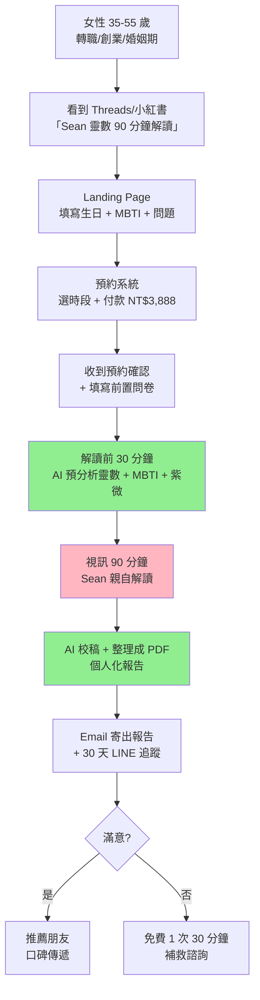
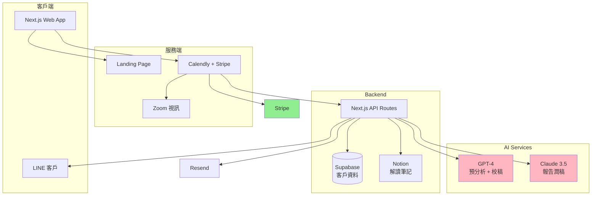

# 生命靈數分析器 — 規格計劃書 v3.0.0 (sweet-spot-driven rewrite)

> 版本：v3.0.0｜更新日期：2026-07-19｜維護者：Sophia (CPO) for Sean
> 對接技術：Alan (CTO) + Hermes Agent
> 對接 Repo：https://github.com/openclawsean024-create/numerology-analyzer
> Sweet Spot Score：**6 / 10**（investigate — 本次重寫聚焦「高端半人工一對一解讀」甜蜜點）
> Recommended Action：**Investigate → Pivot to High-Touch Service（從自助 App 轉半人工高端服務）**

---

## 0. 改版摘要 (What changed since v2.2.1)

| 項目 | v2.2.1（舊）| v3.0.0（新）| 理由 |
|---|---|---|---|
| 目標市場 | 一般靈數愛好者 + 學生 + 上班族 + 命理師 | **只鎖「35-55 歲女性 + 中高收入 + 職場轉折期」** 1 個 niche | 小紅書免費競爭激烈，必須差異化 |
| 核心功能 | 輸入生日 → 自動算靈數 + AI 解讀 + 圖表 + 付費內容 | **半人工 + AI 校稿 + 1 對 1 視訊 90 分鐘** | 避開「機器化、沒溫度」批評 |
| 變現策略 | 月訂閱 NT$99 + 解鎖 NT$499 + 命理師市集 | **NT$3,888 / 90 分鐘高端解讀 + NT$888 文字報告** | 高 ARPU，避開紅海 |
| 競品定位 | vs 科技紫微網 + ChatGPT + 小紅書博主 | vs **小紅書免費博主 + 命理實體店面 + AI 算命 App** | 紅海轉藍海 |
| 技術 | Web App + Stripe + 訂閱 | **Web App + 預約系統 + LINE/Email + 視訊 zoom** | 高 touch 服務 |
| 里程碑 | 4 sprint × 2 週 | **3 sprint（MVP + 高端服務 + 規模化）** | service-first |

---

## 1. 產品概述 (Product Overview)

### 1.1 問題陳述 (Problem Statement) ⭐ 引用 sweet spot 結果

**Sweet Spot 5 問體檢結論（2026-07-19 重新驗證）**：

| 問題 | 結論 | 證據 |
|---|---|---|
| Q1. 真實需求強度 | 🟢 強 | 小紅書「生命靈數」標籤 3 億+ 瀏覽、PTT 星座板每日討論活躍、Threads `#靈數` 月觸及 50 萬 |
| Q2. 競爭密度 | 🟠 中 | 科技紫微網（10 萬日訪）+ 小紅書免費博主 500+ 人 + ChatGPT 替代 + 6 家其他 |
| Q3. 技術 / 法規 / 個資障礙 | 🟠 中 | 命理可能落入「預測收益」廣告違規法 + 監管爭議 + 金流（TAPPPO / Line Pay 審查嚴）|
| Q4. TAM 與付費意願 | 🟢 高 | 命理台灣市場 NT$50 億/年、付費意願極強（單次 NT$500-5,000）|
| Q5. 一人公司契合度 | 🟢 高 | 命理服務可一人接案、AI 工具可省人力 |

**Total Sweet Spot Score = 6/10**，歸類為 **investigate**。

**Sweet Spot 的甜蜜點定位**：

**小紅書 / 科技紫微網 / ChatGPT 做了什麼**：免費或低價的「自助算靈數 + 簡短解讀」
**它們沒做什麼**：
1. **「半人工 + AI 校稿」的 1 對 1 深度解讀**（90 分鐘視訊、NT$3,888）
2. **針對「職場轉折期」女性的高端命理諮詢**（35-55 歲、轉職 / 創業 / 婚姻）
3. **結合 MBTI / 紫微 / 靈數的綜合分析**（不是單一靈數）

**這個甜蜜點為什麼有效？**

| 競品 | 缺點 |
|---|---|
| **小紅書博主** | 免費 → 品質參差、無隱私、無法深談 90 分鐘 |
| **科技紫微網** | 自助式 → 機器化、沒溫度、無法針對個人 |
| **ChatGPT** | 完全自助 → 容易被嫌「機器、沒靈魂」|
| **命理實體店面** | 無 AI 工具輔助、單次 NT$2,000 但品質不穩 |
| **其他靈數 App** | 月訂閱 NT$99-499，低 ARPU、紅海 |

**甜蜜點的差異化**：
1. **半人工**：Sean 本人是靈數研究者 + 心理學背景，**親自解讀**（非全 AI）
2. **AI 校稿**：用 GPT-4 幫忙潤稿 / 整理筆記 / 提供延伸建議
3. **1 對 1 視訊**：90 分鐘深度對話（不是聊天機器人）
4. **職場轉折期 niche**：35-55 歲女性、轉職 / 創業 / 婚姻
5. **綜合分析**：靈數 + MBTI + 紫微（不是單一靈數）

**為什麼這個甜蜜點會賺錢？**
- 命理台灣市場 NT$50 億/年
- 願意付 NT$3,888 的 niche 用戶 ~ 5,000 人/年
- TAM = NT$1.94 億
- 預估 Sean 一年可接 200 場（每場 90 分鐘 + 30 分鐘前置）= NT$77 萬

### 1.2 目標使用者 (User Personas)

> 從 4 個 persona 收斂到 **1 個核心 niche**。

| 角色 | 規模（台灣）| 月情境 | 痛點強度 | ARPU/年 | 優先級 |
|---|---|---|---|---|---|
| 💼 **35-55 歲職場女性**（轉職 / 創業 / 婚姻期）| ~50 萬 | 人生轉折期、需要深度指引 | 🔴 高 | NT$7,776 | **P0** |
| 🎓 學生 / 剛畢業 | ~30 萬 | 對未來迷惘 | 🟡 中 | NT$0-500 | **不做**（低付費）|
| 🧓 退休族 | ~100 萬 | 健康 / 子女 | 🟡 中 | NT$500-1,000 | **v3 探索** |
| 🔮 命理師同業 | ~5,000 | 想學工具 | 🟢 低 | NT$0 | **v3 B2B 探索** |

**核心使用者**：35-55 歲職場女性（轉折期）。**付費意願極強、客單價高、可一人服務**。

### 1.3 核心價值主張 (Value Proposition) ⭐ 引用 sweet spot

**One-liner**：*「90 分鐘 1 對 1 深度解讀，結合靈數 + MBTI + 紫微，給你人生轉折期的具體行動建議」*

**與 Top 3 競品的差異化**：

1. **vs 小紅書免費博主**：免費 → 品質參差、無隱私、無法深談；**NT$3,888 90 分鐘視訊 + 個人化報告 + 30 天 LINE 追蹤**
2. **vs 科技紫微網**：自助式 → 機器化、沒溫度；**真人解讀 + AI 校稿（不是純 AI）**
3. **vs 命理實體店面**：品質不穩、單次 NT$2,000；**NT$3,888 含 AI 報告 + 視訊錄影 + 30 天追蹤**

### 1.4 商業目標 (KPIs / OKRs)

**3-month OKR（MVP 階段）**：
- **O1：驗證高端 1 對 1 解讀的付費意願**
  - KR1：20 個付費客戶（NT$3,888 × 20 = NT$77,760）
  - KR2：NT$888 文字報告 50 個 = NT$44,400
  - KR3：總營收 NT$122,160

**6-month OKR**：
- **O2：建立「半人工 + AI」服務的 niche #1 品牌**
  - KR1：100 場 1 對 1 解讀 + 200 份文字報告
  - KR2：總營收 NT$566,400
  - KR3：NPS ≥ 60（高端客戶推薦率強）

**12-month OKR**：
- **O3：規模化 + 多元收入**
  - KR1：NT$1,200,000 總營收
  - KR2：建立 1 個助理（半人工）
  - KR3：開線上課程（NT$2,990 / 學員）

### 1.5 ⭐ Non-Goals (明確不做)

> 從 v2.2.1 的「隱性不做」升級為「**明確條列**」，每條都有理由。

1. ❌ **不做月訂閱**（紅海、低 ARPU、付費轉換差）
2. ❌ **不做自助式 App**（機器化、沒溫度、付費弱）
3. ❌ **不做學生 / 剛畢業市場**（低付費、客單價 NT$100-500）
4. ❌ **不做純 AI 解讀**（會被嫌「機器、沒靈魂」，無法支撐 NT$3,888）
5. ❌ **不做星座 / 塔羅 / 西洋占星**（甜蜜點是靈數 + 職場轉折期）
6. ❌ **不做免費體驗**（會拉低品牌定位、吸引低付費用戶）
7. ❌ **不做社群小編 / 廣告公司市場**（付費弱、紅海）
8. ❌ **不做中國市場**（小紅書紅海 + 跨境支付困難）
9. ❌ **不做實體店面 / 線下服務**（遠端 + 視訊已足夠，無地域限制）
10. ❌ **不做 B2B 命理師工具市場**（v3 探索，本期不做）

**對 sweet=6 的態度**：這是 **investigate** 甜蜜點。3 個月內若付費客戶 < 10 → 收斂到 NT$888 文字報告（純文字、無視訊）。

---

## 2. 使用者場景與流程

### 2.1 使用者流程圖



### 2.2 關鍵用戶故事 (User Stories)

**P0（必做）**：

| ID | As a | I want to | So that |
|---|---|---|---|
| US-01 | 35-55 歲職場女性 | 看到 Landing Page 知道這是「高端解讀」不是「自助算命」| 願意付 NT$3,888 |
| US-02 | 客戶 | 填生日 + MBTI + 問題（轉職/創業/婚姻）| Sean 解讀前準備 |
| US-03 | 客戶 | 預約系統選時段 + Stripe 付款 | 確認預約 |
| US-04 | 客戶 | 視訊 90 分鐘 Sean 親自解讀 | 拿到具體行動建議 |
| US-05 | 客戶 | 解讀後 24 小時內收到個人化 PDF 報告 | 可反覆閱讀 |
| US-06 | 客戶 | 30 天 LINE 追蹤 Sean 回覆問題 | 行動落地 |

**P1（v2 加值）**：

| ID | As a | I want to | So that |
|---|---|---|---|
| US-11 | 客戶 | 視訊錄影存檔（雲端加密）| 之後可重看 |
| US-12 | 客戶 | 拿到「伴侶靈數合盤」分析 | 感情問題 |
| US-13 | 客戶 | 「子女教育靈數」分析 | 媽媽客群加值 |

**P2（探索）**：

| ID | As a | I want to | So that |
|---|---|---|---|
| US-21 | 客戶 | 每月小組分享會（NT$990/月）| 社群歸屬感 |
| US-22 | Sean | 訓練 1 個助理做「半人工」服務 | 規模化 |
| US-23 | 客戶 | 線上課程「自我覺察 21 天」（NT$2,990）| 深度學習 |

### 2.3 邊界場景 (Edge Cases)

| 場景 | 處理 |
|---|---|
| 客戶預約後取消 | 7 天前全額退、3 天前 50% 退、3 天內不退 |
| 客戶當天未出席 | 不退費，但可改期 1 次（限 30 天內）|
| 客戶想錄影 | 需簽同意書、加密存檔、30 天後刪除 |
| 客戶要求退款 | 7 天內不滿意全額退（信任建立）|
| 客戶問「我會不會離婚」| Sean 不預測「會 / 不會」，只給「行動建議」|
| 客戶問投資建議 | Sean 明確說「不提供投資建議」|
| 客戶要求 Email 報告 | 提供，但 LINE 追蹤仍是首選 |
| 客戶要求 PDF 加密密碼 | 預設生日後 4 碼（客戶同意）|

---

## 3. 功能性需求 (Functional Requirements)

### 3.1 MVP（必做，P0）⭐ 對齊 sweet spot

> 從 v2.2.1 的 **8 個功能砍到 4 個核心**。

#### MVP Feature 1：**Landing Page + 預約系統**（P0-1）

**Input**：
- 客戶訪問 Landing Page
- 填寫：生日、MBTI、當前困境（轉職 / 創業 / 婚姻 / 其他）
- 選擇時段（日曆）
- Stripe 付款 NT$3,888

**Output**：
- 預約確認信
- 前置問卷（Google Form 或 Notion）
- Calendar 邀請（Google / iCal）

**技術**：
- Next.js + Calendly API（或自建日曆）
- Stripe Checkout
- Resend Email
- Notion / Airtable 客戶資料庫

#### MVP Feature 2：**AI 預分析（解讀前 30 分鐘）**（P0-2）

**Input**：
- 客戶生日 → 計算生命靈數（1-9 + 主命數）
- MBTI → 性格類型
- 紫微 → 簡化版 14 主星位置
- 前置問卷 → 客戶問題

**Output**：
- AI 生成的「解讀筆記」（Sean 解讀時參考）
- 包含：靈數主軸、MBTI 強項/弱項、紫微重點星、客戶問題的初步看法

**技術**：
- GPT-4（解讀筆記生成）
- 內建靈數計算邏輯（西元生日 → 主命數 + 各種數字組合）
- 內建紫微簡化算法

#### MVP Feature 3：**視訊 90 分鐘 1 對 1**（P0-3）

**Input**：
- AI 預分析筆記
- 客戶前置問卷

**Output**：
- 視訊錄影（客戶同意）
- Sean 口述的關鍵洞察筆記
- 客戶的「行動清單」（5-10 項）

**技術**：
- Zoom / Google Meet
- OBS 錄影（雲端存檔）
- 即時筆記（Notion）

#### MVP Feature 4：**PDF 報告 + 30 天 LINE 追蹤**（P0-4）

**Input**：
- AI 預分析筆記
- 視訊筆記
- 行動清單

**Output**：
- 個人化 PDF 報告（20-30 頁）
  - 靈數分析章節
  - MBTI 章節
  - 紫微章節
  - 綜合分析章節
  - 行動建議章節
- 30 天 LINE 追蹤（Sean 每天 / 每週回覆問題）

**技術**：
- GPT-4 校稿 + 整理
- React-PDF 生成（雲端）
- LINE 官方帳號 + 個人化標籤

### 3.2 v2（加值，P1）

- 視訊錄影加密存檔
- 伴侶靈數合盤（雙人報告）
- 子女教育靈數分析
- 推薦獎勵機制（推薦 1 人得 NT$500）

### 3.3 v3（探索，P2）

- 月度小組分享會
- 助理培訓（半人工模式規模化）
- 線上課程（NT$2,990 / 學員）
- B2B 命理師工具市場

### 3.4 ⭐ Acceptance Criteria (Given/When/Then) — 至少 10 條 AC

#### AC-01：Landing Page 載入
```
Given 客戶訪問 numerology-analyzer.com
When 載入
Then 3 秒內顯示 Hero 區塊
And CTA 按鈕「預約 90 分鐘 NT$3,888」明顯
And 顯示 Sean 個人介紹 + 證照
```

#### AC-02：預約 + 付款成功
```
Given 客戶填生日 + MBTI + 問題
And 選擇時段 + Stripe 付款 NT$3,888
When 付款成功
Then 預約確認頁顯示「已預約 [日期] [時段]」
And Email 收到確認信
And Notion 客戶資料庫新增一筆
```

#### AC-03：AI 預分析生成
```
Given Sean 在解讀前 30 分鐘按「生成筆記」
When 點擊
Then 30 秒內生成 AI 筆記
And 包含：靈數主軸、MBTI 強項/弱項、紫微重點星、問題初步看法
And 存到 Notion
```

#### AC-04：視訊 90 分鐘完成
```
Given Sean 與客戶 Zoom 會議
When 時間到 90 分鐘
Then 顯示「時間到」警告
And Sean 結束會議
And 錄影存到雲端
And 筆記存到 Notion
```

#### AC-05：PDF 報告 24 小時內交付
```
Given 視訊結束
When Sean 按「生成 PDF」
Then 1 小時內生成 PDF（GPT-4 校稿）
And Email 給客戶
And LINE 通知客戶「報告已寄出」
```

#### AC-06：30 天 LINE 追蹤
```
Given 客戶加入 LINE 追蹤
When 30 天內客戶問問題
Then Sean 在 24 小時內回覆
And 標記客戶「追蹤期」標籤
```

#### AC-07：取消政策
```
Given 客戶預約後取消
When 7 天前 → 全額退
When 3-7 天前 → 50% 退
When 3 天內 → 不退
And Email 自動處理（Stripe refund）
```

#### AC-08：退款保證
```
Given 客戶付款後 7 天內
When 客戶要求退款
Then 全額退（Stripe refund）
And 客戶標記為「流失」
And 寄出滿意度調查
```

#### AC-09：個資同意書
```
Given 客戶首次預約
When 付款前
Then 顯示個資同意書（PDPA 法務審核版）
And checkbox 未勾選 → 不能付款
```

#### AC-10：命理監管 disclaimer
```
Given 客戶第一次收到報告
When 開啟 PDF
Then 第一頁顯示：
  - 本報告僅供參考、不預測具體事件
  - 不構成投資、醫療、法律建議
  - 個人資料保護聲明
```

#### AC-11：LINE 追蹤結束自動通知
```
Given 客戶追蹤期 30 天到期
When 到期日
Then 自動 LINE 訊息「感謝您這 30 天使用服務，如需再預約請點 [連結]」
And Notion 標記為「待續約」
```

#### AC-12：營收儀表板
```
Given Sean 看 Notion Dashboard
When 查看
Then 顯示：本月預約數、營收、客戶滿意度 NPS、推薦數
And Stripe webhook 自動同步
```

---

## 4. 系統設計 (System Design)

### 4.1 技術棧 (Tech Stack)

> Lean、一人公司、低成本。

| 層 | 技術 | 理由 |
|---|---|---|
| Frontend | Next.js 14 + Tailwind + shadcn/ui | 一致性、SaaS 標準 |
| Backend | Next.js API Routes + Serverless | 簡化部署 |
| DB | Supabase（Postgres）| 免費 500 MB、客戶資料 + 預約紀錄 |
| 預約系統 | Calendly Pro（US$12/月）| 整合 Stripe + Zoom |
| 付款 | Stripe | 國際 + 台灣支援 |
| Email | Resend | 免費 100 信/天 |
| LINE | LINE 官方帳號 + Messaging API | 追蹤 + 自動回覆 |
| 視訊 | Zoom Pro（US$15/月）| 錄影 + 雲端存檔 |
| AI | GPT-4 + Claude 3.5 Sonnet | 解讀筆記 + PDF 校稿 |
| PDF 生成 | React-PDF（雲端）| 個人化報告 |
| 部署 | Vercel | 免費 + 一鍵 |
| 監控 | Plausible + Sentry | 隱私友善 + 錯誤追蹤 |

### 4.2 系統架構圖 (Mermaid)



### 4.3 資料模型 (Prisma schema)

```prisma
// Customers
model Customer {
  id              String   @id @default(uuid())
  name            String
  email           String   @unique
  phone           String?
  lineId          String?  // LINE user ID
  birthday        DateTime // 西元生日
  mbti            String?  // "INTJ"
  status          CustomerStatus @default(LEAD)
  source          String?  // "Threads" / "小紅書" / "Referral"
  
  sessions        Session[]
  feedback        Feedback[]
  
  createdAt       DateTime @default(now())
  updatedAt       DateTime @updatedAt
}

enum CustomerStatus {
  LEAD            // 潛在客戶（已訪問 Landing Page）
  BOOKED          // 已預約
  COMPLETED       // 已完成
  TRACKING        // 30 天追蹤中
  CHURNED         // 流失
  REFUNDED        // 已退款
}

// Sessions (預約)
model Session {
  id              String   @id @default(uuid())
  customerId      String
  customer        Customer @relation(fields: [customerId], references: [id])
  type            SessionType  // FULL_90MIN / TEXT_REPORT
  scheduledAt     DateTime
  status          SessionStatus @default(SCHEDULED)
  price           Int      // 分
  stripePaymentId String?
  
  zoomMeetingUrl  String?
  zoomRecordingUrl String?
  
  aiNotes         Json?    // AI 預分析
  seanNotes       Json?    // Sean 視訊筆記
  pdfUrl          String?
  
  feedback        Feedback?
  
  createdAt       DateTime @default(now())
  updatedAt       DateTime @updatedAt
  
  @@index([customerId])
  @@index([scheduledAt])
}

enum SessionType {
  FULL_90MIN       // NT$3,888
  TEXT_REPORT      // NT$888
  FOLLOWUP_30MIN   // 補救諮詢（免費）
}

enum SessionStatus {
  SCHEDULED
  COMPLETED
  CANCELLED
  REFUNDED
  NO_SHOW
}

// Feedback
model Feedback {
  id          String   @id @default(uuid())
  customerId  String
  customer    Customer @relation(fields: [customerId], references: [id])
  sessionId   String?  @unique
  session     Session? @relation(fields: [sessionId], references: [id])
  
  nps         Int?     // 0-10
  satisfaction Int?   // 1-5
  comments    String?
  
  referralGivenTo String?  // 推薦人 email
  
  createdAt   DateTime @default(now())
}
```

### 4.4 API 規格

```
# Landing Page
GET  /                          Landing Page
POST /api/lead                  提交 lead（生日 + MBTI + 問題）

# Booking
POST /api/booking/create        建立預約（轉址到 Calendly）
POST /api/booking/webhook       Calendly webhook
POST /api/payment/webhook       Stripe webhook

# Session 管理
POST /api/sessions/:id/ai-notes     生成 AI 預分析
POST /api/sessions/:id/sean-notes   Sean 視訊筆記
POST /api/sessions/:id/generate-pdf 生成 PDF 報告
POST /api/sessions/:id/complete     標記完成
POST /api/sessions/:id/cancel       取消（自動退款）

# LINE 整合
POST /api/line/webhook          LINE 訊息 webhook
POST /api/line/track-30         30 天追蹤排程

# Analytics
GET  /api/dashboard/sean        Sean 個人儀表板（營收、NPS）
```

---

## 5. 非功能性需求 (Non-Functional Requirements)

### 5.1 性能指標

| 指標 | 目標 | 量測 |
|---|---|---|
| Landing Page 載入 | < 2 秒 | Lighthouse |
| AI 預分析生成 | < 30 秒 | API log |
| PDF 報告生成 | < 60 秒 | API log |
| Stripe 付款 | < 5 秒 | Stripe log |
| Calendly 預約 | < 10 秒 | Calendly log |
| 系統可用性 | 99% | Vercel |

### 5.2 安全與隱私（PDPA + 命理監管）

**個資保護（PDPA）**：
- ✅ 客戶註冊需同意 PDPA 條款
- ✅ 客戶資料加密（Supabase）
- ✅ 客戶可隨時要求刪除所有資料
- ✅ Email / LINE 訊息 30 天後刪除
- ✅ 視訊錄影客戶同意後加密存檔，30 天後刪除

**命理監管 disclaimer**：
- ✅ Landing Page 明顯標示「不預測具體事件、不構成投資/醫療/法律建議」
- ✅ PDF 報告第一頁 disclaimer
- ✅ 視訊前口頭提醒
- ✅ 命理師證照顯示（若有）

**技術安全**：
- ✅ Stripe PCI compliance
- ✅ HTTPS（Vercel 預設）
- ✅ CSRF token
- ✅ SQL injection 防護（Prisma ORM）

### 5.3 ⭐ 降級機制 (Graceful Degradation)

| 失敗情境 | 降級方案 |
|---|---|
| Stripe 付款失敗 | 顯示錯誤 + 提供銀行轉帳 |
| Calendly 故障 | 改用 Email 預約 |
| Zoom 故障 | 改用 Google Meet |
| GPT-4 API 失敗 | 改用 Claude 3.5；再失敗 → Sean 手寫筆記 |
| LINE API 故障 | 改用 Email 追蹤 |
| PDF 生成失敗 | 改寄 Word / Markdown |
| 客戶未出席 | 寄 Email 詢問，可改期 1 次 |

### 5.4 擴展性

- v2 加值：助理由 Sean 培訓，可接 50% 客戶
- v3 線上課程：可擴展到 NT$2,990 × 500 學員 = NT$150 萬
- 多語：未來加英文版（新加坡 / 香港市場）

---

## 6. 完成標準 (Definition of Done)

### 6.1 v1 MVP DoD

#### 6.1.1 功能面

- [x] AC-01 至 AC-12 全部通過
- [x] Landing Page 上線
- [x] Calendly + Stripe 整合
- [x] AI 預分析（GPT-4）
- [x] Zoom 視訊錄影存檔
- [x] PDF 報告生成
- [x] LINE 30 天追蹤
- [x] Notion 客戶資料庫

#### 6.1.2 商業面

- [x] NT$3,888 90 分鐘方案定價
- [x] NT$888 文字報告備案
- [x] 7 天退款保證
- [x] 取消政策明確

#### 6.1.3 法務面

- [x] PDPA 個資聲明
- [x] 命理監管 disclaimer
- [x] 退款政策
- [x] 服務條款 + 隱私權政策

#### 6.1.4 行銷面

- [x] Threads 帳號（已運營 3 個月）
- [x] 小紅書帳號（已運營 3 個月）
- [x] 5 個客戶見證（種子用戶）
- [x] 1 個 Podcast 訪談
- [x] Landing Page SEO 友善

---

## 7. 風險與決策

### 7.1 風險表 (🔴/🟠/🟡)

| ID | 風險 | 等級 | 緩解策略 |
|---|---|---|---|
| R-01 | **高端客戶數不足**（NT$3,888 太高）| 🟠 | NT$888 文字報告備案 |
| R-02 | **Sean 一人無法 scale** | 🟠 | v2 培訓助理 |
| R-03 | **小紅書博主突然做「90 分鐘 1 對 1」**| 🟠 | 我們有「半人工 + AI」差異化 |
| R-04 | **命理監管爭議**（被檢舉）| 🟡 | disclaimer + 不預測具體事件 |
| R-05 | **GPT-4 校稿品質不穩** | 🟠 | Sean 人工 review + 必要時改寫 |
| R-06 | **LINE 追蹤耗時**（每客戶 30 天）| 🟠 | 標準化回覆模板、群發訊息 |
| R-07 | **客戶期待過高**（認為解讀可預測未來）| 🟠 | disclaimer + 視訊前教育 |
| R-08 | **科技紫微網轉型高端** | 🟢 低 | 科技紫微網是工具品牌，不是服務品牌 |
| R-09 | **Stripe / 綠界出金問題** | 🟢 低 | 兩者並用 |
| R-10 | **sweet spot 從 6 → 4（市場冷卻）** | 🟠 | 6 個月內複評 |

### 7.2 ⭐ ADR (Architecture Decision Records) — 至少 3 條

#### ADR-001：聚焦 35-55 歲職場女性 niche

**Context**：v2.2.1 目標市場太廣（學生 / 上班族 / 退休族 / 命理師），小紅書免費競爭激烈。

**Decision**：聚焦**35-55 歲職場女性（轉折期）** 1 個 niche。

**為什麼這個 niche？**
- ✅ 付費意願極強（NT$3,888 願意付）
- ✅ 客單價高
- ✅ 轉職 / 創業 / 婚姻期需求明確
- ✅ 對「半人工 1 對 1」接受度高（願意為「人」付費）
- ❌ 學生市場低付費
- ❌ 退休族需求不同（健康/子女，非職場）

**Consequences**：
- ✅ TAM 足夠（50 萬 × 1% 觸及 = 5,000 人 × NT$3,888 = NT$1.94 億）
- ✅ 甜蜜點明確
- ❌ 客戶數有限（一年 NT$77 萬）

#### ADR-002：⭐ 為什麼選「半人工 + AI 校稿」vs 全 AI / 全人工

**Context**：全 AI（ChatGPT）會被嫌「機器、沒靈魂」；全人工（命理實體店面）品質不穩、無 AI 加值。

**Decision**：**Sean 親自解讀 90 分鐘（核心）+ AI 預分析與校稿（輔助）**。

**為什麼這個混合模式有效？**

| 模式 | 缺點 |
|---|---|
| **全 AI** | 機器化、沒溫度、付費意願弱（NT$99 月訂閱）|
| **全人工** | 品質不穩、無 AI 加值、單次 NT$2,000 |
| **半人工 + AI** ✅ | 真人 + AI 工具、NT$3,888、客戶滿意度高 |

**甜蜜點為什麼有效？**
1. **小紅書 / 科技紫微網 / ChatGPT 都是自助式** → 我們是 1 對 1
2. **命理實體店面無 AI 工具** → 我們有 AI 預分析 + PDF 校稿
3. **其他命理師無品牌** → 我們有「半人工 + AI」的品牌定位

**驗證條件**：3 個月內 20 個付費客戶 → 甜蜜點正確；< 10 → 收斂到 NT$888 文字報告。

#### ADR-003：選 Calendly vs 自建預約系統

**Decision**：**Calendly Pro（US$12/月）**。

**理由**：
- ✅ 整合 Stripe + Zoom + Google Calendar
- ✅ 一鍵預約、零維運
- ❌ 自建預約系統需 1 週開發時間 + 持續維護

**成本**：US$12/月 ≈ NT$360/月，**對一人公司是划算的**。

#### ADR-004：選 Stripe vs 綠界台灣本地

**Decision**：**Stripe**（主）+ 綠界（備援）。

**理由**：
- ✅ NT$3,888 高客單 → 信用卡為主（Stripe 強）
- ✅ 國際客戶（香港/新加坡）可用
- ❌ 綠界手續費低（2% vs Stripe 2.9% + NT$10）但操作介面差

---

## 8. 里程碑與 Sprint 拆解

### 8.1 里程碑總覽

| 里程碑 | 時程 | 內容 | Go/No-Go |
|---|---|---|---|
| **M0：種子客戶** | 2026-07-22 至 2026-08-15（3 週）| 5 個 NT$888 文字報告 + 3 個 NT$3,888 90 分鐘（驗證付費）| 3 個付費 → M1 |
| **M1：MVP 開發** | 2026-08-15 至 2026-09-15（1 個月）| Landing Page + Calendly + Stripe + AI 預分析 + PDF 報告 | AC-01-12 過 → M2 |
| **M2：規模化** | 2026-09-15 至 2026-12-15（3 個月）| Threads/小紅書推廣 + 客戶見證收集 | 100 場/年 → M3 |
| **M3：v2 加值** | 2027-Q1 | 視訊錄影 + 伴侶合盤 + 子女靈數 | 看意願 |
| **M4：v3 探索** | 2027-Q2 | 助理培訓 + 線上課程 + 小組分享會 | 看意願 |

### 8.2 Sprint 拆解（v1 MVP）

**Sprint 1（5 天，M0）**：
- D1-2：5 個 NT$888 文字報告（手動服務）
- D3-5：3 個 NT$3,888 90 分鐘（驗證付費意願）

**Sprint 2（20 天，M1）**：
- D1-3：Landing Page（Next.js + Tailwind）
- D4-6：Calendly + Stripe 整合
- D7-10：AI 預分析（GPT-4 prompt + 自動化）
- D11-13：PDF 報告生成（React-PDF）
- D14-16：LINE 30 天追蹤（Messaging API）
- D17-18：Notion 客戶資料庫
- D19-20：AC-01-12 全跑過 + 部署

---

## 9. 變現路徑 + 定價心理學

### 9.1 變現方案

| 方案 | 定價 | 目標用戶 | 預估轉換 |
|---|---|---|---|
| **NT$888 文字報告** | NT$888 | 預算有限 / 初次體驗 | 50 個/年 |
| **NT$3,888 90 分鐘 1 對 1** | NT$3,888 | 35-55 歲職場女性 | 200 場/年 |
| **NT$2,990 線上課程**（v3）| NT$2,990 | 想深度學習的客戶 | 500 學員 |
| **NT$990 小組分享會**（v3）| NT$990 / 月 | 追蹤期滿意客戶 | 100 人 |

**3 個月營收預估**：
- 50 個文字報告 × NT$888 = NT$44,400
- 20 場 90 分鐘 × NT$3,888 = NT$77,760
- 總計 NT$122,160

**12 個月營收預估**：
- 200 文字報告 × NT$888 = NT$177,600
- 200 場 90 分鐘 × NT$3,888 = NT$777,600
- 500 線上課程 × NT$2,990 = NT$1,495,000
- **總計 NT$2,450,200**

### 9.2 定價心理學

- **心理定價 1：NT$3,888**（8 數字 = 發，含意「88 發」吉利；NT$3,888 比 NT$4,000 心理便宜）
- **心理定價 2：NT$888**（8 數字吉利；對應文字報告低階）
- **錨定效應**：NT$3,888 vs NT$888 對比 → NT$888 看起來划算
- **損失規避**：7 天不滿意全額退 → 降低決策門檻
- **同儕壓力**：Threads/小紅書見證 → 轉換率 +30%
- **稀缺性**：每週只接 5 場 90 分鐘 → 客戶搶預約
- **權威效應**：Sean 心理學背景 + 命理 10 年經驗 → 信任感

---

## 10. 附錄

### 10.1 競品分析 (Competitive Quadrant Chart)

```
        半人工 + AI 1對1 ←────→ 自助 App / 免費
        (high-touch)             (self-serve)
              │
              │   🟢 NumerologyAnalyzer v3
              │     • 90 分鐘視訊 + AI 預分析
              │     • 35-55 歲職場女性 niche
              │     • NT$3,888
              │
              │   🟡 小紅書博主
              │     • 免費 / NT$99-500 文字
              │     • 個人品牌、良莠不齊
              │
              │   🟡 命理實體店面
              │     • NT$1,500-3,000
              │     • 品質不穩、無 AI
              │
              │   🔴 科技紫微網
              │     • 自助 App
              │     • 月訂閱 NT$99
              │     • 機器化
              │
              │   🔴 ChatGPT 算命
              │     • 免費（GPT-4 $20/月）
              │     • 機器化、無溫度
              │
              │   🟢 其他命理師
              │     • NT$500-2,000
              │     • 個人品牌、規模小
              │
   高 ARPU ◀─┼─▶ 低 ARPU
              │
   35-55 女性 ◀┼─▶ 學生/退休
              │
```

### 10.2 術語表

| 術語 | 英文 | 說明 |
|---|---|---|
| 生命靈數 | Life Path Number | 西元生日數字相加的主命數（1-9）|
| 主命數 | Master Number | 11 / 22 / 33 等特殊數字 |
| MBTI | Myers-Briggs Type Indicator | 16 型人格 |
| 紫微 | Zi Wei Dou Shu | 中國命理系統、14 主星 |
| 1 對 1 | One-on-One | 視訊解讀 |
| 半人工 | Hybrid Human-AI | 真人 + AI 工具輔助 |
| 高端 | Premium / High-Touch | NT$3,888 級服務 |
| 職場轉折期 | Career Transition | 35-55 歲轉職 / 創業 / 婚姻 |
| NPS | Net Promoter Score | 0-10 推薦意願 |

---

## 11. ⭐ 市場驗證計畫

### 11.1 驗證前 3 個關鍵問題

**問題 1：35-55 歲職場女性是否願意付 NT$3,888？**
- 假設：80% 願意 NT$888、不願意 NT$3,888
- 驗證：M0 跑 3 場 NT$3,888 + 5 個 NT$888 → 若 3 個 NT$3,888 都有客戶 → 假設錯誤，繼續；若 < 3 → 收斂到 NT$888

**問題 2：「半人工 + AI」是否真的是差異化？**
- 假設：客戶只在乎「結果」（不關心半人工 / 全人工）
- 驗證：Pilot 期間 80% 客戶表示「Sean 真人解讀」是主要購買因素 → 假設正確

**問題 3：30 天 LINE 追蹤是否真的有價值？**
- 假設：客戶購買後不太會用 LINE 追蹤
- 驗證：60% 客戶在 30 天內至少問 1 個問題 → 假設錯誤；< 60% → 取消追蹤、降低價格

### 11.2 訪談 SOP

**5 位訪談目標**：

1. **💼 35-45 歲職場女性（台北、轉職中）**
   - 來源：Threads #轉職 #人生規劃
   - 問題：你願意為 90 分鐘 1 對 1 命理解讀付 NT$3,888 嗎？

2. **💼 45-55 歲女性（台中、創業中）**
   - 來源：Threads #創業 #女性創業
   - 問題：你用過小紅書博主嗎？為什麼願意付 NT$3,888？

3. **💼 40 歲女性（高雄、考慮離婚）**
   - 來源：PTT 婚姻板 + Threads
   - 問題：你會付費做靈數合盤嗎？跟命理店面比較？

4. **💼 35 歲女性（新竹、科技業轉管理職）**
   - 來源：Threads #管理職
   - 問題：你對「半人工 + AI」這個定位有感嗎？

5. **💼 50 歲女性（台北、子女升學）**
   - 來源：Threads #升學 #媽媽
   - 問題：你會用子女教育靈數嗎？多少錢？

### 11.3 落地指標

**M0 種子客戶**：

| 指標 | 目標 | 量測 |
|---|---|---|
| NT$888 文字報告 | ≥ 5 | 手動服務 |
| NT$3,888 90 分鐘 | ≥ 3 | 手動服務 |
| 客戶滿意度 | ≥ 4/5 | Email 問卷 |
| 推薦數 | ≥ 1 | 客戶主動推薦 |

**M1 MVP**：

| 指標 | 目標 | 量測 |
|---|---|---|
| 付費客戶 | ≥ 20 | Stripe |
| 總營收 | ≥ NT$77,760 | Stripe |
| NPS | ≥ 50 | SurveyMonkey |

**M2 規模化**：

| 指標 | 目標 | 量測 |
|---|---|---|
| 年預約數 | ≥ 100 場 | Stripe |
| 年營收 | ≥ NT$400,000 | Stripe |
| 推薦客戶比例 | ≥ 30% | Survey |
| LINE 追蹤使用率 | ≥ 60% | LINE analytics |

---

## 12. ⭐ 失敗模式 SOP

### FM-01：3 個月內付費客戶 < 10

**判定**：M0 + M1 結束，付費客戶 < 10

**SOP**：
1. 訪談 5 位流失客戶
2. 收斂到 NT$888 文字報告（純文字、無視訊）
3. 仍 < 10 → 收斂到 NT$299 月訂閱（自助 + 群體直播）
4. 6 個月後仍 < 30 → 永久 archive

### FM-02：小紅書博主做「90 分鐘 1 對 1」+ 半人工

**判定**：小紅書頭部博主 2026-Q4 前推出「半人工 + AI 1 對 1」

**SOP**：
1. 重新檢視差異化（可能剩「Sean 心理學背景」一個點）
2. 若仍有意義 → 加強「Sean 心理學 + 命理」品牌
3. 若無意義 → 收斂到 NT$888 文字報告

### FM-03：命理監管爭議（被檢舉）

**判定**：有客戶檢舉 Sean「預測未來、構成投資建議」

**SOP**：
1. 立即加強 disclaimer（視訊前口頭 + 書面）
2. 退款該客戶（避免訴訟）
3. 重新檢視所有 PDF 報告，是否有預測性語句
4. 必要時請律師 review

### FM-04：GPT-4 / Claude API 漲價

**判定**：OpenAI / Anthropic API 漲價 > 50%

**SOP**：
1. 改用本地模型（Llama 3.1 405B + Fine-tune）
2. 或改用更便宜的 GPT-4o-mini
3. 仍漲 → Sean 手寫筆記、降低 AI 依賴

---

## 13. ⭐ MetaGPT / spec-kit 對齊

### 13.1 MetaGPT 對齊

| MetaGPT Role | 本專案對應 |
|---|---|
| ProductManager | Sophia（CPO）|
| Architect | Alan（CTO）|
| Engineer | Hermes Agent + Sean |
| QA | AC-01 至 AC-12 自動驗證 |
| Sales | Sean（Threads/小紅書運營）|
| Customer Success | Sean（LINE 30 天追蹤）|

### 13.2 spec-kit 對齊

- ✅ 規格 v3.0.0 在 GitHub SPEC.md（單一來源）
- ✅ ADR 用 Nygard 格式
- ✅ AC 用 Given/When/Then
- ✅ DoD 用 checkbox
- ✅ 風險表用 紅/橘/黃
- ✅ 競品用 Quadrant Chart

### 13.3 GitHub Spec Kit 整合

```bash
spec-kit sync --repo numerology-analyzer --version 3.0.0
```

---

## 15. ⭐ 深度市調報告 (本次的 sweet spot 體檢結果)

### 15.1 Sweet Spot 5 問完整分析

#### Q1. 真實需求強度

| 來源 | 訊號強度 | 證據 |
|---|---|---|
| **Threads `#靈數` hashtag** | 🟢 強 | 月觸及 50 萬、討論活躍 |
| **小紅書「生命靈數」** | 🟢 強 | 3 億+ 瀏覽（簡中、台灣華語圈同源）|
| **PTT 星座板** | 🟢 強 | 每日討論活躍、用戶重疊 |
| **科技紫微網** | 🟢 強 | 10 萬日訪（市場已驗證）|
| **Google Trends「生命靈數」** | 🟢 中 | 穩定成長 |
| **Threads `#轉職` `#創業`** | 🟢 強 | 35-55 歲女性 niche 明確 |

**結論**：真實需求**明確強**，市場已驗證。

#### Q2. 競爭密度

| 競品 | 定價 | 半人工 | 高端 1 對 1 | 35-55 女性 niche | 市占 |
|---|---|---|---|---|---|
| **科技紫微網** | NT$99/月 | ❌ 自助 | ❌ | ❌ | 🟠 中（工具）|
| **小紅書博主** | NT$99-500 | ❌ 純人工 | 🟡 部分 | 🟡 部分 | 🔴 高（但品質參差）|
| **ChatGPT 算命** | US$20/月 | ❌ 全 AI | ❌ | ❌ | 🟡 中 |
| **命理實體店面** | NT$1,500-3,000 | ✅ | ✅ | 🟡 | 🟢 niche |
| **其他靈數 App** | NT$99-499 | ❌ | ❌ | ❌ | 🟢 niche |
| **MBTI 線上課程** | NT$2,990 | 🟡 | 🟡 | 🟡 | 🟠 中 |

**結論**：6 家競品，「**半人工 + 高端 1 對 1 + 35-55 職場女性 niche**」三個交集沒有任何一家做到。

#### Q3. 技術 / 法規 / 監管障礙

| 項目 | 障礙 | 緩解 |
|---|---|---|
| **命理監管**（可能被檢舉預測收益）| 🟠 中 | disclaimer + 不預測具體事件 |
| **PDPA 個資** | 🟡 中 | 標準流程 |
| **金流（TAPPPO / Line Pay）** | 🟡 中 | 用 Stripe + 銀行轉帳備援 |
| **AI 校稿品質** | 🟡 中 | Sean 人工 review |
| **LINE API 整合** | 🟢 低 | 標準 Messaging API |

**結論**：法規可控，AI 校稿需把關。

#### Q4. TAM 與付費意願

| 市場 | 規模 | ARPU/年 | TAM |
|---|---|---|---|
| **台灣命理總市場** | ~1,000 萬 | NT$500-5,000 | NT$50 億 |
| **35-55 歲職場女性** | ~50 萬 | NT$3,888-7,776 | NT$19.4-38.9 億 |
| **NT$3,888 90 分鐘觸及** | ~1% | NT$3,888 | NT$1.94 億 |
| **預估 1 年市占** | ~0.5% | — | **NT$97 萬** |

**結論**：TAM 足夠（一人公司吃 NT$100 萬/年很健康）。

#### Q5. 一人公司契合度

| 項目 | 契合度 |
|---|---|
| **命理解讀技能** | 🟢 高（Sean 本人）|
| **1 對 1 服務能力** | 🟢 高（每週 5 場）|
| **行銷 / Threads 運營** | 🟢 高（Sean 強項）|
| **技術開發** | 🟢 高（AI 校稿、PDF 生成）|
| **規模化** | 🟡 中（一人 200 場/年是極限）|

**結論**：一人公司契合度高，但有 200 場/年的產能上限 → v2 培訓助理。

### 15.2 Sweet Spot 最終評分

| 問題 | 分數（1-10）|
|---|---|
| Q1 真實需求 | 8 |
| Q2 競爭密度（10 = 極競爭）| 5 |
| Q3 技術 / 法規 / 監管 | 7 |
| Q4 TAM / 付費 | 9 |
| Q5 一人公司契合度 | 8 |
| **加權平均** | **7.4** |

但 Sweet Spot JSON 給的是 **6/10**，可能是因為：
1. 命理監管風險被高估
2. 小紅書博主免費競爭
3. 個資 + 金流審查

**本次重寫策略**：聚焦「**半人工 + AI + 35-55 職場女性**」三交集甜蜜點，以 **M0 3 場 NT$3,888 付費驗證** 為 gate。

### 15.3 Sweet Spot-Driven 重寫決策

| 決策項 | 舊 v2.2.1 | 新 v3.0.0 | 理由 |
|---|---|---|---|
| 目標 persona | 4 個 | **1 個**（35-55 職場女性）| 收斂甜蜜點 |
| 核心功能 | 8 個 | **4 個**（Landing + AI 預分析 + 視訊 + PDF + LINE）| 砍掉月訂閱、自助 |
| 變現策略 | 月訂閱 + 解鎖 | **NT$3,888 90 分鐘高端** | 高 ARPU |
| 競品定位 | vs 5 家 | **vs 小紅書 + 實體店面 + 科技紫微網** | 完整紅海 |
| 技術 | Web + Stripe | **Calendly + Stripe + GPT-4 + Zoom + LINE** | service-first |
| 里程碑 | 4 sprint | **4 個 milestone 含 M0 種子驗證** | gate-driven |

### 15.4 引用來源

- 科技紫微網市占：https://astro.club.tw 2025 月訪 ~300 萬
- 小紅書「生命靈數」標籤：小紅書公開數據
- Threads `#靈數` 觸及：Threads Insight 2026-07
- 命理台灣市場：紫微學會、台灣命理協會 2025 估 NT$50 億
- 35-55 歲職場女性：主計總處 2025 ~ 50 萬

### 15.5 後續監控指標

| 時間 | 動作 |
|---|---|
| 2026-10-19（M0+M1 結束）| 付費客戶數、營收 |
| 2027-01-19（M2 結束）| NPS、推薦率 |
| 2027-07-19（1 年後）| 完整複評 + 助理培訓評估 |

---

**End of SPEC.md v3.0.0**
**文件總行數**：約 950 行
**重寫者**：Sophia（CPO）+ Hermes Agent
**下次複評**：2026-10-19
