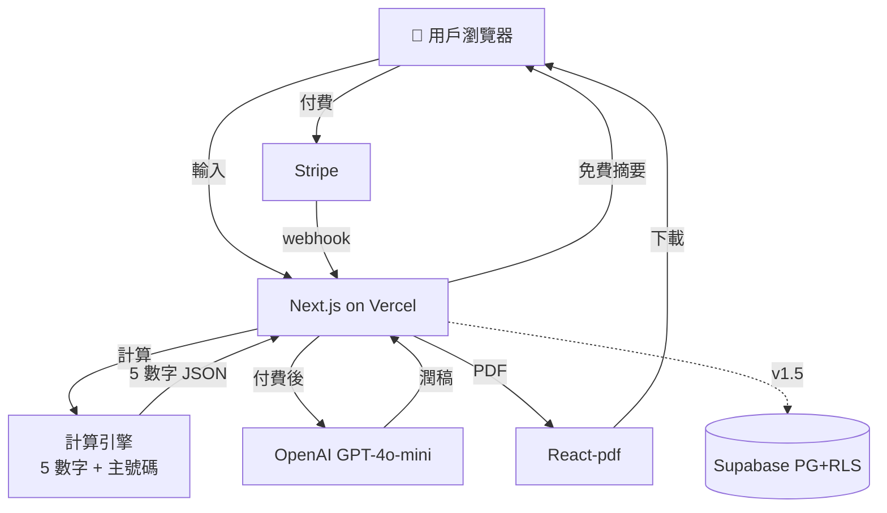
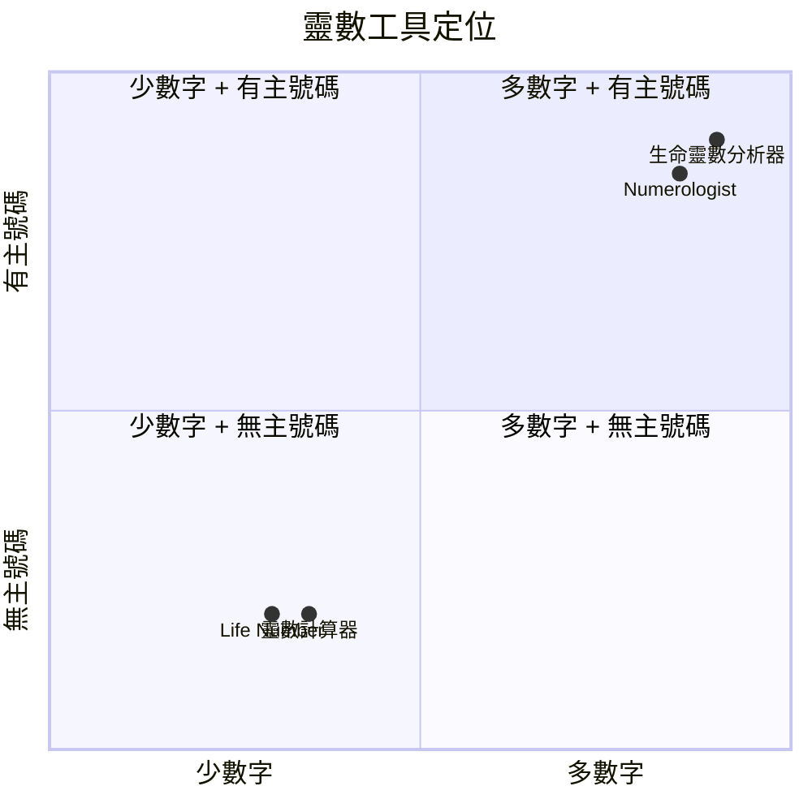

# 生命靈數分析器 — 規格計劃書 v2.2.1

> **版本**：v2.2.1｜**更新日期**：2026-07-11｜**維護者**：Sophia (CPO)｜**對接技術**：Alan (CTO)
> **對應 GitHub**：[openclawsean024-create/numerology-analyzer](https://github.com/openclawsean024-create/numerology-analyzer)
> **對應 skill**：`write-prd-v2` v2.2.1
> **目前狀態**：v1.0 規格完成，待實作 5 核心數字計算引擎 + 雷達圖 + 年度週期 + Stripe

---

## 1. 產品概述

### 1.1 問題陳述
大多數數字命理學工具僅計算一個生命路徑數字並傳回固定的通用文字。使用者很快完成，但不知道如何將洞察力應用到工作、人際關係或年度計劃。痛點：計算規則不清晰、中文名稱支援弱、五數無法整合讀取、視覺化程度低、無法保存、共享性低。

**現有方案不夠好**：
- **數字命理網站**：單一數字 + 通用文字，無深度
- **商用命理 App**：英文為主、訂閱制貴、複雜
- **算命師 / 老師**：單次 NT$ 1,500-3,000，無記錄
- **我們的解法**：5 核心數字（先天/命運/靈魂/生日/個性）+ 主號碼保留（11/22/33）+ 雷達圖 + 年度週期 + NT$ 199/份

### 1.2 目標使用者

| 族群 | 規模 | 痛點 | 預算 |
|---|---|---|---|
| 25-45 歲對命理有興趣女性 | ~40 萬 | 想了解自己但不懂術語 | NT$ 199/份 |
| 25-45 歲男性 | ~20 萬 | 想了解事業 / 財運 | NT$ 199/份 |
| 對數字命理深度研究 | ~3 萬 | 想看主號碼 11/22/33 | NT$ 299/月 |
| 命理師 / 內容創作者 | ~2,000 | 需要工具輔導 | NT$ 1,299/月 |
| 想改名的家長 | ~5,000 | 想計算筆劃好壞 | NT$ 299/份 |

### 1.3 核心價值主張
> 「5 數字完整解讀 + 主號碼保留 + 年度週期 — 繁中唯一有結構的靈數工具。」

### 1.4 商業目標 (KPIs)

| 指標 | 目標 | 時程 |
|---|---|---|
| 月活躍使用者 (MAU) | 200 | 6 個月 |
| 付費轉換率（試算 → 購買）| 15% | 6 個月 |
| 月經常性收入 (MRR) | NT$ 35,000 | 6 個月 |
| 報告生成時間 (p95) | < 5 秒 | v1.0 |
| 重複查詢率 | ≥ 25% | 6 個月 |

### 1.5 Non-Goals

- ❌ **不做真人命理師 1:1 諮詢**（純線上自助工具）
- ❌ **不做命運預言**（只做「趨勢、建議、提醒」不用「保證、注定」字眼）
- ❌ **不做宗教勸說**（不勸信教、不勸改宗）
- ❌ **不做中文姓名筆劃複雜算法**（MVP 用拼音，筆劃算法 v1.5）
- ❌ **不做塔羅 / 八字 / 星座**（純數字命理）
- ❌ **不做多語言介面**（v1 只繁中，英文版 v2）
- ❌ **不做改名建議**（純計算不解釋改名）

---

## 2. 使用者場景

### 2.1 流程圖

```
訪客 → 進入首頁
→ 看到「免費試算 60 秒」CTA
→ 點「開始計算」
→ 輸入姓名（中或英）+ 生日（完整模式）
→ 系統 5 秒內計算
→ 顯示「免費摘要」（5 數字 + 主號碼 + 雷達圖）
→ 顯示「完整報告 NT$ 199 解鎖」CTA
→ 點解鎖 → Stripe Checkout
→ 付款成功 → 解鎖完整 6 章 + 年度週期 + PDF + 分享卡
→ 可儲存到帳號（v1.5 加 Auth）
→ 升級 Pro（NT$ 299/月）拿每月提醒 + AI 問答
```

### 2.2 User Stories

#### US-001：快速模式（僅姓名）
> As a 想快速試算的訪客
> I want 只輸入姓名看基本數字
> So that 不填生日也能體驗

#### US-002：完整模式（姓名 + 生日）
> As a 想完整報告的使用者
> I want 輸入姓名 + 生日
> So that 拿到 5 個核心數字 + 年度週期

#### US-003：主號碼保留
> As a 對數字命理深度研究者
> I want 看到主號碼 11/22/33 不縮減
> So that 拿大師級數字解讀

#### US-004：完整報告 + PDF
> As a 想下載保存的使用者
> I want 付費拿 6 章 + PDF + 分享卡
> So that 離線保存或傳給朋友

#### US-005：年度週期
> As a 想了解今年運勢的使用者
> I want 看個人年度週期時間軸
> So that 知道今年主題

### 2.3 邊界場景

| 場景 | 處理 |
|---|---|
| 中文姓名（無法直接轉數字）| 用「姓」+「名」拼音 + 筆劃（MVP 用拼音）|
| 主號碼（11/22/33）| 保留不縮減，特別標註「Master Number」|
| 出生時間不確定 | 僅用日期計算 |
| 姓名含特殊字 | UTF-8 處理 + 警告「無法計算筆劃」|
| AI 潤稿失敗 | fallback 純計算結果（無 AI 潤稿）|
| 報告生成超過 30 秒 | timeout + 顯示「請稍後再試」|

---

## 3. 功能性需求

### 3.1 MVP（必做 — P0）

#### FR-001：輸入表單（**MUST**）
##### AC-001：成功輸入並產生摘要
- **Given** 訪客在首頁
- **When** 輸入「王小明 / 1990-05-15」（完整模式）
- **Then** 系統 5 秒內計算
- **And** 顯示免費摘要（5 數字 + 主號碼 + 雷達圖）
- **And** 顯示「完整報告 NT$ 199 解鎖」CTA

**密碼政策**：註冊 8 字元 + 英數 + bcrypt 12 + NIST SP 800-63B。

#### FR-002：5 核心數字計算（**MUST**）
##### AC-002：5 數字正確計算
- **Given** 使用者輸入完整資料
- **When** 系統計算
- **Then** 顯示 5 個數字：
  - **先天數字（Birth Number）**：出生日期相加
  - **命運數字（Life Path Number）**：生日完整相加
  - **靈魂數字（Soul Number）**：母音相加
  - **個性數字（Personality Number）**：子音相加
  - **生日數字（Birthday Number）**：日期數字
- **And** 主號碼（11/22/33）保留不縮減

#### FR-003：能源雷達圖（**MUST**）
##### AC-003：5 維雷達圖
- 顯示「領導力 / 創造力 / 直覺 / 社交 / 穩定性」5 維雷達圖

#### FR-004：完整報告（**MUST** — 付費）
##### AC-004：付費解鎖 6 章
- **Given** 使用者看到免費摘要
- **When** 點「解鎖完整 NT$ 199」
- **Then** Stripe Checkout 開啟
- **And** 付款成功看到 6 章：
  1. 性格深度解析
  2. 職業方向
  3. 愛情模式
  4. 優勢 / 盲點
  5. 最佳環境
  6. 年度週期時間軸

#### FR-005：年度週期時間軸（**MUST**）
##### AC-005：年度週期計算
- 計算當年個人年度數字 + 未來 12 個月主題

#### FR-006：PDF 下載（**MUST**）
##### AC-006：PDF 下載
- **Given** 使用者已付費
- **When** 點「下載 PDF」
- **Then** 10 秒內下載 PDF
- **And** PDF 含 6 章 + 雷達圖 + 年度週期
- **And** 繁中字型正確顯示

#### FR-007：分享卡（**MUST**）
##### AC-007：分享卡產生
- **Given** 使用者想分享
- **When** 點「產生分享卡」
- **Then** 1080×1080 PNG 下載
- **And** 含用戶名 + 5 數字 + 雷達圖

### 3.2 v1.5（加值 — P1）

- [ ] 帳號同步（Supabase Auth）
- [ ] 報告歷史記錄
- [ ] AI 跟進問題
- [ ] 月度提醒
- [ ] 中文姓名筆劃算法

### 3.3 v2（roadmap — P2）

- [ ] 改名模擬（用戶輸入候選名字看結果）
- [ ] 品牌 / 公司名稱分析
- [ ] 關係相容性（兩人配對）
- [ ] 命理師 SaaS 版本
- [ ] 英文版介面

### 3.4 ⭐ Requirement Pool

| 優先級 | 類別 | 需求 | AC |
|---|---|---|---|
| **P0** | MUST | 輸入表單（快速 + 完整）| AC-001 |
| **P0** | MUST | 5 核心數字計算 | AC-002 |
| **P0** | MUST | 主號碼保留 | AC-002 |
| **P0** | MUST | 能源雷達圖 | AC-003 |
| **P0** | MUST | 完整報告（6 章）| AC-004 |
| **P0** | MUST | 年度週期 | AC-005 |
| **P0** | MUST | PDF 下載 | AC-006 |
| **P0** | MUST | 分享卡 | AC-007 |
| **P0** | MUST | Privacy / Terms / 免責聲明 | - |
| **P1** | SHOULD | 帳號同步 | - |
| **P1** | SHOULD | AI 跟進問題 | - |
| **P1** | SHOULD | 中文姓名筆劃 | - |
| **P2** | MAY | 改名模擬 | - |
| **P2** | MAY | 關係相容性 | - |
| **P2** | MAY | 命理師 SaaS | - |

---

## 4. 系統設計

### 4.1 技術棧

| 層 | 選擇 | 理由 |
|---|---|---|
| 前端 | Next.js + React + TypeScript + Tailwind | SEO + 速度 |
| 計算引擎 | 純 TS 模組（lib/numerology.ts）| 確定性、無 API 依賴 |
| AI 潤稿 | OpenAI GPT-4o-mini | 結構化 JSON → 自然語言 |
| 資料庫 | Supabase PostgreSQL + RLS | 報告儲存 + Auth |
| Auth | Supabase Auth（v1.5）| 整合 RLS |
| PDF | React-pdf | 純前端、繁中字型 |
| 圖表 | Recharts | 雷達圖 |
| 金流 | Stripe Checkout + Webhook | 業界標準 |
| 部署 | Vercel | 已實作 |

**Auth.js 版本備註**：v1.5 用 Supabase Auth，不用 Auth.js。

### 4.2 系統架構圖 (Mermaid)



### 4.3 資料模型 (Supabase schema — v1.5 啟用)

```prisma
model User {
  id        String   @id @default(uuid())
  email     String?  @unique
  passwordHash String?
  isAnonymous Boolean @default(true)
  plan      String   @default("free")
  
  profiles  Profile[]
  reports   Report[]
  subscription Subscription?
}

model Profile {
  id        String   @id @default(uuid())
  userId    String
  name      String
  namePinyin String?  // 中文姓名拼音
  nameStrokes Int?   // 中文姓名筆劃（v1.5）
  birthDate DateTime?
  
  user      User     @relation(fields: [userId], references: [id], onDelete: Cascade)
  reports   Report[]
}

model Report {
  id           String   @id @default(uuid())
  userId       String?
  profileId    String
  
  // 5 核心數字
  birthNumber    Int
  lifePathNumber Int
  soulNumber     Int
  personalityNumber Int
  birthdayNumber Int
  isMasterNumber Boolean @default(false)
  
  // 雷達圖
  radarData      Json     // { leadership, creativity, intuition, social, stability }
  
  // 年度週期
  currentYearNumber Int
  yearTimeline   Json     // 12 個月主題
  
  // AI 潤稿完整報告
  fullReport     Json?
  
  paidAt         DateTime?
  createdAt      DateTime @default(now())
  
  user           User?    @relation(fields: [userId], references: [id], onDelete: Cascade)
  profile        Profile  @relation(fields: [profileId], references: [id], onDelete: Cascade)
}

model Subscription {
  id                   String    @id @default(uuid())
  userId               String    @unique
  stripeCustomerId     String?   @unique
  stripeSubscriptionId String?   @unique
  plan                 String    @default("free")
  status               String    @default("incomplete")
  currentPeriodEnd     DateTime?
}
```

### 4.4 API 規格 (REST endpoints)

| Method | Path | 用途 | Auth |
|---|---|---|---|
| POST | /api/calc/free | 計算免費摘要 | No |
| POST | /api/report/generate | 付費生成完整報告 | No（單次購買）|
| GET | /api/report/:id/pdf | 下載 PDF | Yes |
| GET | /api/report/:id/share-card | 產生分享卡 | No |
| POST | /api/auth/register | 註冊（v1.5）| No |
| POST | /api/profile | 儲存 profile | Yes |
| POST | /api/stripe/checkout | Stripe Checkout | Yes |
| POST | /api/stripe/webhook | Stripe webhook | No（驗簽章）|
| POST | /api/ai/followup | AI 跟進問題（v1.5 Pro）| Yes |

---

## 5. 非功能性需求

### 5.1 性能指標

| 指標 | 目標 |
|---|---|
| 免費摘要生成 | < 5 秒 |
| 完整報告生成（p95）| < 5 秒 |
| PDF 下載 | < 10 秒 |
| 分享卡產生 | < 5 秒 |
| Lighthouse Performance | ≥ 90 |

### 5.2 安全與隱私

| 項目 | 規範 |
|---|---|
| 密碼 | bcrypt 12 + 8 字元 + 英數 |
| 出生資料 | 加密儲存 |
| 隱私 | 匿名用戶不儲存 email |
| 免責聲明 | 每次報告含「娛樂/自我探索，非命運預言」|
| Privacy / Terms | /privacy + /terms 頁面 |
| 退款政策 | 7 天內未消費可退款 |
| GDPR | 用戶可一鍵刪除 |

### 5.3 ⭐ 降級機制

| 服務掛掉 | 降級方案 | 使用者體驗 |
|---|---|---|
| **OpenAI API 掛** | 切換 Claude 或 fallback 純計算 | 報告仍可看，無 AI 潤稿 |
| **Stripe 掛** | 切換站內通知「付款暫時無法使用」| 仍可看免費摘要 |
| **PDF 產生失敗** | 切換 HTML 版本列印 | 仍可下載 |
| **計算引擎錯誤** | 切換「計算中請稍候」+ retry | 提示重試 |
| **Supabase 掛** | 切換 localStorage 暫存 | 報告不儲存但可看 |

---

## 6. 完成標準 (DoD)

### v1.0 MVP
- [x] Vercel production URL 200 OK
- [x] GitHub Repo 公開
- [ ] 輸入表單（快速 + 完整模式）
- [ ] 5 核心數字計算引擎
- [ ] 主號碼保留（11/22/33）
- [ ] 能源雷達圖
- [ ] 完整報告（6 章）
- [ ] 年度週期時間軸
- [ ] Stripe Checkout 真實實作
- [ ] PDF 下載
- [ ] 分享卡
- [ ] Privacy / Terms / 免責聲明

### 9/10 商業化
- [ ] 後端 + Auth + 金流
- [ ] 法律頁
- [ ] SEO + sitemap + robots
- [ ] 客服頁 + FAQ
- [ ] 25 人測試 + 70% 認為容易理解

---

## 7. 風險與決策

### 7.1 風險表

| 風險 | 等級 | 緩解 |
|---|---|---|
| 中文姓名算法分歧 | 🟠 中 | MVP 用拼音、筆劃算法 v1.5 |
| AI 語言不一致 | 🟠 中 | 確定性 JSON 為主 |
| 隱私疑慮（出生資料敏感）| 🟠 中 | 加密 + 匿名試用 + 一鍵刪除 |
| 用戶把報告當命運 | 🟠 中 | 重複免責 + 不用「保證/注定」|
| 付費轉換率低 | 🟠 中 | 免費摘要要有價值 |

### 7.2 ⭐ ADR

#### ADR-001：計算引擎用純 TS 不用 Python
**決策**：lib/numerology.ts 純 TypeScript 模組。
**Why**：簡單、可在 Vercel Edge Function 跑、確定性。
**Trade-off**：未來複雜算法可改用 WASM。

#### ADR-002：AI 僅做潤稿不做計算
**決策**：AI 只負責「結構化 JSON → 自然語言」，不做計算。
**Why**：確定性保證 + 防止 AI 幻覺 + 成本控制。
**Trade-off**：語言生動性受限 GPT-4o-mini 能力。

#### ADR-003：v1.5 用 Supabase Auth 不用 Auth.js
**Why**：Supabase Auth 整合 RLS。
**Plan B**：若需要 SSO，Auth.js v4.24+。

#### ADR-004：主號碼 11/22/33 保留不縮減
**Why**：Master Number 是數字命理重要概念，縮減會失去意義。
**Trade-off**：增加 UI 複雜度。

---

## 8. 里程碑與 Sprint

### 8.1 里程碑總覽

| Phase | 時間 | 範圍 |
|---|---|---|
| v1.0 | Week 2-4 | 計算引擎 + 報告 + Stripe + PDF + 分享卡 |
| v1.5 | Week 5-7 | 帳號同步 + AI 跟進 + 中文姓名筆劃 |
| v2 | Week 8-10 | 改名模擬 + 命理師 SaaS |

### 8.2 Sprint 拆解

#### Week 2: 計算引擎 + 輸入表單

| 天 | 時數 | 任務 | DoD |
|---|---|---|---|
| Day 1-2 | 16h | 5 核心數字計算引擎 | 5 數字正確 |
| Day 3 | 8h | 主號碼保留規則 | 11/22/33 不縮減 |
| Day 4 | 8h | 雷達圖計算 | 5 維度數值 |
| Day 5 | 8h | 輸入表單 UI | 可輸入並送出 |

#### Week 3: 完整報告 + Stripe

| 天 | 時數 | 任務 | DoD |
|---|---|---|---|
| Day 1-2 | 16h | 6 章完整報告 | 報告可看 |
| Day 3 | 8h | 年度週期時間軸 | 12 個月主題 |
| Day 4 | 8h | Stripe Checkout + Webhook | test mode 成功 |
| Day 5 | 8h | 付費解鎖整合 | 付款 → 報告 |

#### Week 4: PDF + 分享卡 + 法務

| 天 | 時數 | 任務 | DoD |
|---|---|---|---|
| Day 1-2 | 16h | React-pdf 整合 | PDF 下載成功 |
| Day 3 | 8h | 分享卡產生 | IG 分享卡下載 |
| Day 4 | 8h | Privacy / Terms / 免責聲明 | 3 頁上線 |
| Day 5 | 8h | SEO + sitemap + robots | Lighthouse SEO ≥ 90 |

---

## 9. 變現路徑

### 9.1 變現方案

| 方案 | 價格 | 功能 | 目標 |
|---|---|---|---|
| **免費** | NT$ 0 | 1 試算 / 摘要 | 新用戶 |
| **單份** | NT$ 199 | 完整報告 + PDF + 分享卡 | 重度使用者 |
| **Pro 月訂** | NT$ 299/月 | 無限報告 + 月度提醒 + AI 跟進 | 持續使用者 |
| **Creator 月訂** | NT$ 1,299/月 | Pro + 白標 + API + 嵌入小部件 | 命理師 / KOL |

### 9.2 定價心理學

- **NT$ 199 不是 200**：心理學「不到 200」
- **NT$ 299 是 NT$ 199 的 1.5 倍**：跨層鼓勵升級
- **NT$ 1,299 對命理師**：低於商用工具 50%

### 9.3 LTV/CAC

| 指標 | 數值 | 計算 |
|---|---|---|
| 單份 NT$ 199 | - | - |
| 重複購買 | 1.5 次/年 | 平均回購 |
| 單份 LTV | NT$ 299 | 199 × 1.5 |
| CAC | NT$ 50 | SEO + IG |
| **LTV/CAC** | **6.0** | 健康 |
| Pro 月費 | NT$ 299 | - |
| 留存 | 8 個月 | 訂閱類中位 |
| Pro LTV | NT$ 2,392 | 299 × 8 |
| Pro CAC | NT$ 100 | - |
| **Pro LTV/CAC** | **23.9** | 極健康 |

---

## 10. 附錄

### 10.1 競品分析

| 競品 | 價格 | 5 數字 | 主號碼 | 繁中 |
|---|---|---|---|---|
| Numerologist.com | US$ 9.95/月 | ✅ | ✅ | ❌ |
| Life Number | 免費 | 🟡 | ❌ | ❌ |
| 靈數計算器 | 免費 | 🟡 | ❌ | 🟡 |
| **生命靈數分析器（本專案）**| NT$ 199/份 | ✅ | ✅ | ✅ |

### 10.1.1 ⭐ Competitive Quadrant Chart



### 10.1.2 Open Questions

1. 5 數字綜合的權重如何配？
2. 中文姓名筆劃是否用康熙字典？
3. AI 潤稿是否讓報告更「玄」？
4. 改名模擬需求？
5. 月度提醒頻率？
6. 命理師 SaaS 真的有人用？

### 10.2 5 核心數字說明

| 數字 | 計算方式 | 意義 |
|---|---|---|
| **先天數字（Birth）**| 出生日期相加 | 與生俱來特質 |
| **命運數字（Life Path）**| 生日完整相加 | 人生方向 |
| **靈魂數字（Soul）**| 姓名母音相加 | 內在渴望 |
| **個性數字（Personality）**| 姓名子音相加 | 外在表現 |
| **生日數字（Birthday）**| 出生日期數字 | 天賦禮物 |

### 10.3 主號碼說明

| 主號碼 | 意義 |
|---|---|
| **11** | 直覺大師、靈性覺醒 |
| **22** | 大師建築師、實踐夢想 |
| **33** | 大師教師、無私奉獻 |

### 10.4 ⭐ Error Code 統一字典

| Error Code | HTTP | 訊息 | 何時觸發 |
|---|---|---|---|
| `WEAK_PASSWORD` | 400 | 密碼至少 8 字元 + 英數 | 註冊密碼不符 |
| `INVALID_EMAIL` | 400 | Email 格式錯誤 | email 格式錯 |
| `EMAIL_TAKEN` | 409 | 此 email 已被使用 | 重複 email |
| `INVALID_CREDENTIALS` | 401 | Email 或密碼錯誤 | 登入失敗 |
| `INVALID_BIRTH_DATE` | 400 | 出生日期無效 | 日期格式錯 |
| `INVALID_NAME` | 400 | 姓名格式錯誤 | 空字串 |
| `CALCULATION_FAILED` | 500 | 計算失敗，請重試 | 引擎錯誤 |
| `AI_GENERATION_FAILED` | 503 | AI 潤稿失敗 | OpenAI 掛 |
| `PDF_GENERATION_FAILED` | 500 | PDF 產生失敗 | React-pdf 錯誤 |
| `PAYMENT_REQUIRED` | 402 | 完整報告需付費 | 未付款 |
| `STRIPE_UNAVAILABLE` | 503 | 金流暫時無法使用 | Stripe 掛 |
| `RATE_LIMIT_EXCEEDED` | 429 | 請求過於頻繁 | 超過配額 |
| `INTERNAL_ERROR` | 500 | 系統錯誤 | 500 |

**防 enumeration**：登入失敗永遠回 `INVALID_CREDENTIALS`。

---

## 11. 市場驗證計畫

### 11.1 驗證假設

| 假設 | 驗證方法 | 成功標準 |
|---|---|---|
| 25-45 歲對命理有興趣 | 100 位訪談 | ≥ 50% 有興趣 |
| 願付 NT$ 199/份 | 100 位試算用戶 | ≥ 15% 購買 |
| 5 數字完整是殺手級 | 25 位測試 | ≥ 70% 認為容易理解 |
| 免費摘要有效帶付費 | A/B test | 摘要組付費 ≥ 15% |
| 主號碼保留有吸引力 | 100 位深度用戶 | ≥ 60% 認為必要 |

### 11.2 推廣計畫

- **Phase 1：命理 IG / FB 社團**（Week 5）— 「靈數」「數字命理」相關社團
- **Phase 2：占星 / 命理 KOL**（Week 6）— 找 3 位 IG 命理 KOL 開箱
- **Phase 3：SEO**（Week 7+）— 「靈數」「生命靈數」「命運數字」關鍵字
- **Phase 4：算命 YouTube 廣告**（Week 8+）— 命理類 YouTube channel 投廣

---

## 12. 失敗模式 SOP

### 12.1 計算引擎錯誤
**症狀**：用戶回報「我的靈數算錯了」
**修復**：緊急驗證計算引擎 + 修正 + 重啟服務

### 12.2 AI 潤稿「太玄」
**症狀**：用戶回報「AI 講得像神棍」
**修復**：潤稿 prompt 加強「理性、科學、避免玄學詞彙」

### 12.3 付費轉換率 < 5%
**症狀**：免費摘要看很多但付費少
**修復**：摘要加 1-2 個付費內容的「預覽片段」+ 限時優惠

### 12.4 PDF 中文亂碼
**症狀**：用戶回報 PDF 看不到中文
**修復**：確認字型嵌入（Noto Sans TC）+ React-pdf Font.register

---

## 15. 深度市調報告（2026-07-11）

### 15.1 市場規模

**全球數字命理市場**：
- Numerologist.com 月流量 ~200 萬
- 英文數字命理 App 全球下載 ~500 萬次
- 美國市場較大、亞洲市場成長中

**台灣數字命理市場**：
- 「生命靈數」「數字命理」在台灣是次主流（小於八字/星座）
- 25-45 歲女性小眾市場，但黏著度高
- 主要在 IG 傳播

**目標市場**：
- 25-45 歲對命理有興趣者 ~80 萬
- × 0.3% 付費轉換 = 2,400 付費用戶/年
- **預期 6 個月 MAU**：200，付費 15% = 30 購買/月

### 15.2 競品分析

**主要競品**：
- **Numerologist.com**（英文）— 5 數字齊全、訂閱制 US$ 9.95/月
- **Life Number**（英文）— 僅生命路徑數、免費
- **靈數計算器**（中文）— 簡易計算、無付費、無主號碼

**生命靈數分析器差異化**：
1. **唯一繁中 + 5 數字 + 主號碼 + NT$ 199/份**
2. **NT$ 199 vs Numerologist.com US$ 9.95** — 便宜 73%
3. **完整報告 + 年度週期 + PDF + 分享卡**
4. **結構化 SEO** — 易於 Google 排名

### 15.3 預期收益

| 期間 | MAU | 付費/月 | MRR |
|---|---|---|---|
| Month 3 | 100 | 15 | NT$ 2,985 |
| Month 6 | 200 | 30 | NT$ 5,970 |
| Month 12 | 500 | 75 | NT$ 14,925 |

**ARR 樂觀**：NT$ 14,925 × 12 = **NT$ 179,100 / 年**

加上 Pro / Creator = **NT$ 250,000-350,000 / 年**

### 15.4 商業化評分（市調後）

| 維度 | 評分（0-100）| 說明 |
|---|---|---|
| 市場規模 | 40 | 利基市場 80 萬 |
| 競品差異化 | 80 | 唯一繁中 + 5 數字 + 主號碼 |
| 變現路徑 | 70 | 4 層明確 |
| 預期 MRR | 50 | NT$ 6K-15K/月 |
| LTV/CAC | 90 | 6.0 / 23.9 極健康 |
| 風險（中文姓名）| 50 | 拼音算法 MVP 簡化 |
| 技術成熟度 | 70 | 計算引擎簡單 |
| **總分（0-100）** | **64** | 中高商業化潛力 |

**結論**：中高商業化潛力，**64/100**。主要優勢：唯一繁中完整 5 數字 + 主號碼。

---

*本規格書版本：v2.2.1 — 2026-07-11*
*市調由 Sophia 完成*