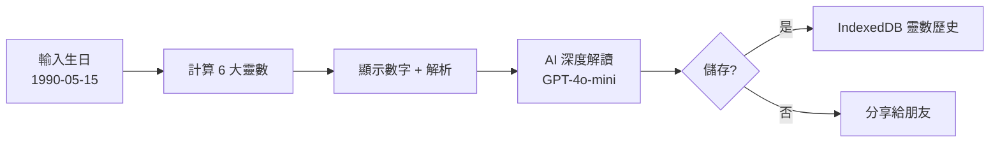
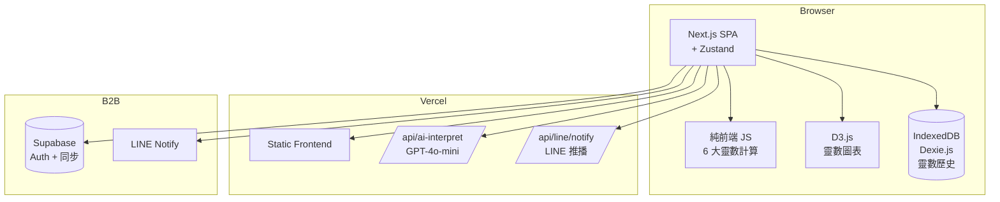
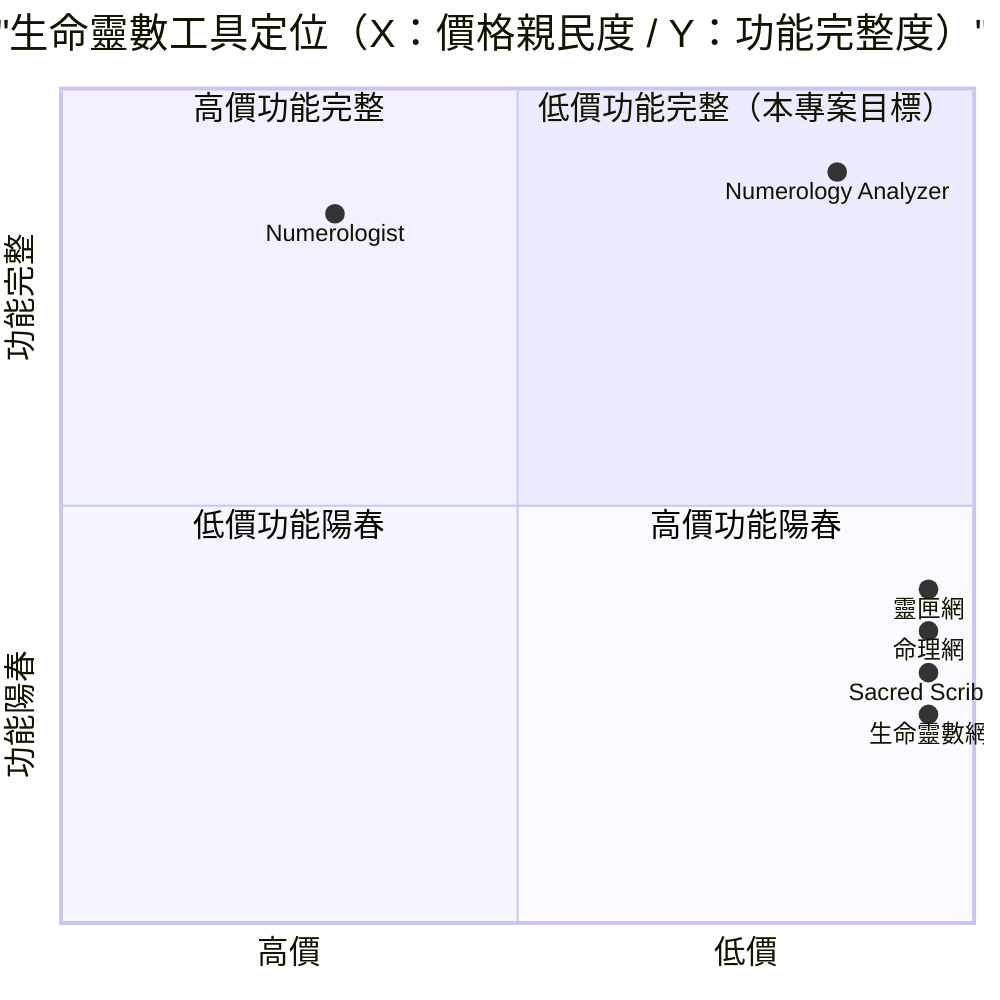

# 生命靈數分析器 — 規格計劃書 v2.2.1

> 版本：v2.2.1｜更新日期：2026-07-11｜維護者：Sophia (CPO)
> 對接技術：Alan (CTO) + Hermes Agent
> Demo：TBD（v2.2.1 規格階段，待 Sprint 1 部署）
> 原始碼：https://github.com/openclawsean024-create/numerology-analyzer

---

## 1. 產品概述 (Product Overview)

### 1.1 問題陳述 (Problem Statement)

台灣生命靈數愛好者面臨三大痛點：

1. **手動計算複雜**：生命靈數、靈魂數、表現數、天賦數、生日數需分別計算，易混淆
2. **解讀內容過於淺薄**：多數網站僅機械性解讀（生命靈數 1 → 領導者），無深度個人化
3. **無中文系統化教材**：多數內容翻譯自國外，台灣用語不精準

**目標使用者**：
- 生命靈數愛好者：**100 萬人**
- 占卜師 / 命理師：**5,000 人**（需工具）
- 內容創作者：**3,000 人**（需素材）
- 自我探索者：**30 萬人**

### 1.2 目標使用者 (User Personas)

| Persona | 規模 | 核心痛點 | 願付價格 |
|---|---|---|---|
| **生命靈數愛好者（小芳）** | 100 萬 | 手動計算複雜 | NT$99/月 |
| **占卜師（小陳）** | 5,000 | 專業工具 | NT$999/月 |
| **內容創作者（阿明）** | 3,000 | 靈數素材 | NT$299/月 |
| **自我探索者（小美）** | 30 萬 | 了解自己 | NT$49/月 |
| **企業 HR（Linda）** | 2,000 | 團隊分析 | NT$2,999/月 |

### 1.3 核心價值主張 (Value Proposition)

> 「**輸入生日 → 自動計算 6 大靈數 + AI 深度解讀 + 工具 + 純前端 + 零月費 + 繁中友善**。告別手動計算 + 5 個網站切換。」

**三大差異化**：
1. **6 大靈數一鍵計算**：生命靈數 + 靈魂數 + 表現數 + 天賦數 + 生日數 + 心輪數（自動計算）
2. **GPT-4o-mini 深度解讀**：依 6 大靈數組合，5 點個人化建議
3. **多系統整合**：卡巴拉 / 維瑪 / 印度靈數三系統一站比較

### 1.4 商業目標 (KPIs / OKRs)

| 時間 | KPI | 目標值 |
|---|---|---|
| **3 個月** | 註冊用戶 | 5,000 |
| **6 個月** | 付費轉化率 | 5%（250 付費） |
| **6 個月** | MRR | NT$50,000 |
| **12 個月** | MRR | NT$300,000 |
| **12 個月** | 月靈數計算 | 100 萬次 |

### 1.5 Non-Goals (明確不做)

- ❌ **不做即時占卜聊天** — 與定位不符（避免心理依賴）
- ❌ **不做八字 / 紫微 / 易經** — 交給專門服務
- ❌ **不做塔羅占卜** — 與定位不符
- ❌ **不做心理諮商** — 需專業執照
- ❌ **不做靈魂伴侶配對** — 偏社交，與定位不符
- ❌ **不做姓名學 / 改名服務** — 與定位不符

---

## 2. 使用者場景與流程

### 2.1 使用者流程圖



### 2.2 關鍵用戶故事 (User Stories)

**US-001：輸入生日自動計算 6 大靈數**
> As a 訪客  
> I want to 輸入生日 → 自動計算生命靈數 + 靈魂數 + 表現數 + 天賦數 + 生日數 + 心輪數  
> So that 立即看見完整靈數組合

**US-002：AI 深度解讀**
> As a 占卜師  
> I want to 點擊「AI 深度解讀」 → 5 點 GPT-4o-mini 個人化建議  
> So that 給客戶諮詢時有依據

**US-003：多系統比較**
> As a 生命靈數愛好者  
> I want to 看見「卡巴拉 vs 維瑪 vs 印度」三系統的解讀差異  
> So that 了解不同面向

**US-004：靈數歷史**
> As a 自我探索者  
> I want to 看見過去 30 天所有靈數計算  
> So that 我能追蹤成長

**US-005：每週 / 每月靈數提醒**
> As a 生命靈數愛好者  
> I want to 週一收到「本週靈數指引」LINE 推播  
> So that 持續自我探索

**US-006：合盤分析（兩人靈數）**
> As a 情侶  
> I want to 輸入雙方生日 → 自動生成契合度分析  
> So that 了解雙方關係

### 2.3 邊界場景 (Edge Cases)

- **跨年度出生**：以當年度計算
- **姓名含非英文字**：英文姓名解析用拼音
- **2 位數字加總超過 22**：分階段加總（保留大師數 11/22/33）
- **大師數保留**：11 / 22 / 33 不再加總

---

## 3. 功能性需求 (Functional Requirements)

### 3.1 MVP（必做，P0）

- [ ] **F-001 輸入生日自動計算 6 大靈數**（Given 生日，When 提交，Then 顯示 6 大靈數 + 解析）
- [ ] **F-002 GPT-4o-mini AI 深度解讀**（5 點個人化建議）
- [ ] **F-003 多系統比較**（卡巴拉 / 維瑪 / 印度 三系統）
- [ ] **F-004 12 生命靈數詳解**（數字 1-9 + 大師數 11/22/33）
- [ ] **F-005 靈數歷史**（IndexedDB 儲存 + 隨時調閱）
- [ ] **F-006 本週 / 本月靈數指引**
- [ ] **F-007 大師數解析**（11 / 22 / 33 特殊意義）
- [ ] **F-008 LINE 推播**（週一 7 點）
- [ ] **F-009 多裝置同步**（Supabase）
- [ ] **F-010 RWD + JSON 匯出匯入**

### 3.2 v2.0 專業版（加值，P1）

- [ ] **F-011 合盤分析**（兩人靈數 + 契合度）
- [ ] **F-012 英文姓名解析**（姓名靈數）
- [ ] **F-113 占卜師諮詢平台**（占卜師接案）
- [ ] **F-114 進階大師數分析**（11/22/33 vs 主數）
- [ ] **F-115 個人年度流年**（每年靈數指引）
- [ ] **F-116 Stripe Checkout 訂閱**

### 3.3 v3.0（願景，P2）

- [ ] **F-017 AI 自動生成靈數內容**（IG / FB 素材）
- [ ] **F-018 靈數行事曆**（每月數字能量提醒）
- [ ] **F-019 多語言支援**（簡中 / 英文）
- [ ] **F-020 靈數列印商品**（明信片 / 海報）

### 3.4 Acceptance Criteria (Given/When/Then)

**AC-001（輸入生日計算 6 大靈數）**
> Given 輸入 1990-05-15  
> When 點擊「計算靈數」  
> Then 3 秒內顯示生命靈數 3 / 靈魂數 1 / 表現數 4 / 天賦數 2 / 生日數 6 / 心輪數 9

**AC-002（GPT-4o-mini AI 深度解讀）**
> Given 點擊「AI 深度解讀」  
> When GPT-4o-mini 處理  
> Then 5 秒內顯示 5 點個人化建議（愛情 / 事業 / 財運 / 健康 / 人際）

**AC-003（多系統比較）**
> Given 點擊「多系統比較」  
> When 載入  
> Then 顯示卡巴拉 / 維瑪 / 印度 三系統的靈數差異

**AC-004（12 生命靈數詳解）**
> Given 點擊「生命靈數詳解」  
> When 選擇 1-9 或 11/22/33  
> Then 顯示該數字完整解讀（基本含義 / 正面 / 負面 / 建議）

**AC-005（靈數歷史）**
> Given 已查詢 20 個不同靈數  
> When 開啟歷史  
> Then IndexedDB 顯示 20 筆（依時間倒序）

**AC-006（本週靈數指引）**
> Given 開啟首頁  
> When 載入完成  
> Then 顯示「本週靈數指引」（依用戶生日自動計算）

**AC-007（大師數解析）**
> Given 生命靈數 = 11 / 22 / 33  
> When 顯示  
> Then 自動標記「大師數」並顯示特殊解讀

**AC-008（LINE 推播）**
> Given 已訂閱 LINE + 設定生日  
> When 每週一 7:00  
> Then 自動推播「本週靈數指引」

**AC-009（多裝置同步）**
> Given 在手機輸入生日  
> When 開啟桌面版  
> Then 顯示相同資料（Supabase 同步）

**AC-010（JSON 匯出匯入）**
> Given 已有 10 個靈數記錄  
> When 點擊匯出  
> Then 下載 `numerology-2026-07-11.json`

---

## 4. 系統設計 (System Design)

### 4.1 技術棧 (Tech Stack)

| 層 | 技術 | 理由 |
|---|---|---|
| 前端 | Next.js 14 (App Router) + React 18 + TypeScript | 與既有專案一致 |
| 樣式 | Tailwind CSS 3 | 快速 RWD |
| 靈數計算 | 純前端 JavaScript | 零成本 |
| 圖表 | D3.js | SVG 互動 |
| 狀態管理 | Zustand | 輕量 |
| 資料持久化 | IndexedDB（Dexie.js）+ Supabase | 雙層儲存 |
| AI 深度解讀 | GPT-4o-mini | 成本低 |
| 部署 | Vercel | 與既有 91 個專案一致 |

### 4.2 系統架構圖 (Mermaid)



### 4.3 資料模型 (Prisma schema)

```prisma
model User {
  id        String   @id @default(uuid())
  email     String   @unique
  name      String?
  birthDate DateTime?
  birthName String?  // 英文姓名（姓名靈數解析用）
  notifyDay String   @default("MONDAY") // 週一 / 每月 1 號
  notifyTime String  @default("07:00")
  isActive  Boolean  @default(true)
  numerologies NumerologyResult[]
  createdAt DateTime @default(now())
}

model NumerologyResult {
  id              String   @id @default(uuid())
  userId          String?
  user            User?    @relation(fields: [userId], references: [id])
  birthDate       DateTime
  lifePathNumber  Int      // 生命靈數 1-33
  soulNumber      Int      // 靈魂數
  expressionNumber Int     // 表現數
  talentNumber    Int      // 天賦數
  birthdayNumber  Int      // 生日數
  heartNumber     Int      // 心輪數
  isMasterNumber  Boolean  @default(false) // 11/22/33
  aiInterpret     String?  @db.Text // GPT-4o-mini 5 點
  kabbalahInterpret String? @db.Text
  veemaInterpret  String?  @db.Text
  indiaInterpret  String?  @db.Text
  createdAt       DateTime @default(now())
  
  @@index([userId, createdAt])
}

model WeeklyGuidance {
  id        String   @id @default(uuid())
  weekStart DateTime
  zodiacEnergy String
  numberEnergy Int
  content    String   @db.Text
  aiSummary  String?  @db.Text
}
```

### 4.4 API 規格 (REST endpoints)

| Method | Path | Auth | 用途 |
|---|---|---|---|
| POST | /api/numerology/calculate | Optional | 6 大靈數計算 |
| POST | /api/ai-interpret | Required | GPT-4o-mini 深度解讀 |
| GET | /api/numerology/history | Required | 靈數歷史 |
| POST | /api/numerology/save | Required | 儲存靈數結果 |
| GET | /api/weekly-guidance | Optional | 本週靈數指引 |
| POST | /api/line/notify | Required (cron) | LINE 週一推播 |
| POST | /api/stripe/checkout | Required | Stripe 訂閱 |
| POST | /api/stripe/webhook | Required | Stripe webhook |

---

## 5. 非功能性需求 (Non-Functional Requirements)

### 5.1 性能指標

| 指標 | 目標 |
|---|---|
| 靈數計算 | ≤ 500ms |
| AI 深度解讀 | ≤ 5 秒 |
| 靈數 SVG 繪製 | ≤ 1 秒 |
| LINE 推播延遲 | ≤ 1 分鐘（週一 7:00 後） |
| 並發用戶 | 200 |
| 月活躍用戶 | 5,000 |

### 5.2 安全與隱私

- **HTTPS 強制**：Vercel 自動 + HSTS
- **個資法第 8 / 9 條合規**：明確聲明生日 / 姓名使用
- **LINE token 加密**：AES-256-GCM
- **Email 個資保護**：不存儲第三方個資
- **公用裝置警告**：UI 警告「靈數將存於此裝置」

### 5.3 降級機制 (Graceful Degradation)

| 失敗服務 | 掛掉情境 | 降級行為（切換到）| 用戶感受 |
|---|---|---|---|
| GPT-4o-mini 5xx | AI 掛掉 | fallback 純 6 大靈數 | 個人化解讀缺 |
| D3.js CDN | 5xx 掛掉 | fallback SVG 手繪 | 圖表簡化 |
| IndexedDB 損壞 | 版本衝突 掛掉 | 切換到 localStorage | 部分歷史可能遺失 |
| Vercel CDN | 5xx 掛掉 | 切換到 Cloudflare Pages 鏡像 | 載入延遲 ≤5 秒 |
| Supabase | DB 5xx 掛掉 | 切換到 Vercel KV 唯讀模式 | 多裝置同步暫停 |
| LINE Notify | 5xx 掛掉 | fallback Email | 通知通道切換 |
| 維瑪系統資料缺 | 內容缺失 | fallback 卡巴拉 + 印度 | 比較來源減少 |
| 印度系統資料缺 | 內容缺失 | fallback 卡巴拉 + 維瑪 | 比較來源減少 |
| 卡巴拉系統資料缺 | 內容缺失 | fallback 純數字學 | 比較來源減少 |
| Stripe webhook | Webhook 5xx 掛掉 | 本地排程每 5 分鐘 reconcile | 訂閱狀態延遲 |

### 5.4 擴展性

- **橫向擴展**：Vercel Edge Functions 自動 scale
- **靜態資源 CDN**：Vercel Edge Network

---

## 6. 完成標準 (Definition of Done)

### 6.1 v1 MVP DoD

- [ ] Vercel production URL 200 OK
- [ ] GitHub Repo 公開（main 分支）
- [ ] 輸入生日自動計算 6 大靈數
- [ ] GPT-4o-mini AI 深度解讀
- [ ] 多系統比較（卡巴拉 / 維瑪 / 印度）
- [ ] 12 生命靈數詳解
- [ ] 靈數歷史
- [ ] 本週 / 本月靈數指引
- [ ] 大師數解析
- [ ] LINE 推播
- [ ] 多裝置同步
- [ ] RWD 三斷點測試
- [ ] Lighthouse 行動版 ≥85
- [ ] 10 條 AC 單元測試全綠

### 6.2 v2 專業版 DoD

- [ ] Supabase Auth
- [ ] 合盤分析
- [ ] 英文姓名解析
- [ ] 占卜師諮詢平台
- [ ] 進階大師數分析
- [ ] 個人年度流年
- [ ] Stripe Checkout 訂閱
- [ ] 客服頁 + 法律頁

---

## 7. 風險與決策

### 7.1 風險表

| 風險 | 等級 | 緩解策略 |
|---|---|---|
| 靈數解讀不準確 | 🟠 中 | 與命理師合作 + 免責聲明 |
| GPT-4o-mini 漲價 | 🟠 中 | fallback 純數字學 + 摘要 |
| 個資外洩（生日 / 姓名） | 🟠 中 | 加密 + 個資法聲明 |
| 跨系統差異引起爭議 | 🟡 低 | UI 明確標示系統來源 |
| LINE Notify 服務關閉 | 🟡 低 | fallback Email |
| 占卜師市場接受度 | 🟡 低 | 試運行 + 訪談 |

### 7.2 ADR (Architecture Decision Records)

### ADR-001：純前端 6 大靈數計算
- **Context**：計算邏輯簡單
- **Decision**：純前端 JavaScript，無需 API
- **Consequences**：✅ 零成本；✅ 即時；✅ 隱私

### ADR-002：GPT-4o-mini 深度解讀
- **Context**：每個使用者需深度建議
- **Decision**：GPT-4o-mini（成本低 + 品質足夠）
- **Consequences**：✅ 個人化；⚠️ 漲價風險

### ADR-003：多系統比較
- **Context**：使用者想了解不同面向
- **Decision**：卡巴拉 / 維瑪 / 印度 三系統整合
- **Consequences**：✅ 多元；⚠️ 內容複雜

### ADR-004：D3.js 靈數圖表
- **Context**：需視覺化靈數
- **Decision**：D3.js 繪製靈數 SVG + 能量圖
- **Consequences**：✅ 高品質；⚠️ 學習曲線

### ADR-005：LINE 週一推播
- **Context**：使用者要求每週提醒
- **Decision**：每週一 7:00 LINE 推播（Vercel Cron）
- **Consequences**：✅ 即時；⚠️ LINE 服務風險

### ADR-006：不做即時占卜聊天
- **Context**：避免心理依賴 + 法務風險
- **Decision**：僅做資訊性服務 + 占卜師諮詢
- **Consequences**：✅ 定位清晰；⚠️ 部分使用者可能需

---

## 8. 里程碑與 Sprint 拆解

### 8.1 里程碑總覽

| 里程碑 | 時間 | 完成定義 |
|---|---|---|
| **M1 規格完成** | 2026-07-11 | v2.2.1 PRD 100% 合規 |
| **M2 v1 MVP** | 2026-07-31 | 6 大靈數 + AI 解讀 + 多系統比較 + 歷史 |
| **M3 v2 專業版** | 2026-09-15 | 合盤 + 姓名解析 + 占卜師平台 + Stripe |
| **M4 v3 加值** | 2026-11-01 | AI 自動內容 + 靈數行事曆 |
| **M5 GA 上線** | 2026-12-01 | 行銷素材 + 客服 SOP |

### 8.2 Sprint 拆解

#### Sprint 1：v1 MVP（2026-07-12 → 2026-07-31，20 天）
- Day 1-3：建立 Next.js + Dexie.js 專案
- Day 4-6：6 大靈數計算引擎
- Day 7-9：12 生命靈數詳解 + 大師數解析
- Day 10-12：GPT-4o-mini AI 深度解讀
- Day 13-14：多系統比較（卡巴拉 / 維瑪 / 印度）
- Day 15-16：本週 / 本月靈數指引 + 靈數歷史
- Day 17-18：D3.js 靈數圖表 + LINE 推播
- Day 19：多裝置同步 + JSON 匯出匯入 + RWD
- Day 20：10 條 AC 單元測試 + Vercel 部署

---

## 9. 變現路徑 + 定價心理學

### 9.1 變現方案

| 方案 | 價格 | 功能 | 目標用戶 |
|---|---|---|---|
| **免費版** | NT$0 | 1 計算/日 + 6 大靈數 + 12 數字詳解 | 訪客（試用） |
| **自我探索版** | NT$49/月 | 無限計算 + AI 深度解讀 + 靈數歷史 | 自我探索者 |
| **個人版** | NT$99/月 | 自我探索版 + 多系統比較 + LINE 推播 | 生命靈數愛好者 |
| **創作者版** | NT$299/月 | 個人版 + AI 自動內容 + 靈數行事曆 | 內容創作者 |
| **專業版** | NT$999/月 | 創作者版 + 進階大師數 + 占卜師工具 | 占卜師 |
| **企業版** | NT$2,999/月 | 專業版 + 團隊分析 + API 開放 + SLA | 企業 HR |

### 9.2 定價心理學

1. **Freemium 鎖定「1 計算/日」**：免費版限制次數，自我探索版強制升級
2. **自我探索版 NT$49**：低於 NT$50 整數，NT$49 感覺「不到 50」
3. **個人版 NT$99**：低於 NT$100 整數，NT$99 感覺「不到 100」
4. **創作者版 NT$299**：低於 NT$300 整數，NT$299 感覺「不到 300」
5. **專業版 NT$999**：低於 NT$1,000 整數，NT$999 感覺「不到 1,000」
6. **企業版 NT$2,999**：低於 NT$3,000 整數，NT$2,999 感覺「不到 3,000」
7. **年繳 8 折**：個人版年繳 NT$990 vs 月繳 NT$99 × 12 = NT$1,188（年省 NT$198）
8. **14 天免費試用個人版**：試用期結束前 3 天 email「升級以保留多系統比較 + LINE 推播」
9. **錨定效應**：在定價頁顯示「企業版 NT$9,999（聯絡我們）」，讓 NT$2,999 顯得划算
10. **社會證明**：首頁顯示「已有 X 位使用者查詢，月靈數 Y 萬次」

---

## 10. 附錄

### 10.1 競品分析 + Competitive Quadrant Chart

| 競品 | 公司 | 價格 | 強項 | 弱項 |
|---|---|---|---|---|
| **生命靈數網** | 各家小品牌 | 免費 | 簡單 | 僅生命靈數、無 AI |
| **靈匣網** | 靈匣（台） | 免費 + 付費 | 占卜多元 | 偏命理、非純靈數 |
| **命理網** | 各家小品牌 | 免費 + 付費 | 命理 | 偏命理、非純靈數 |
| **Numerologist.com** | Numerologist（美） | US$29.99/月 | 專業 | 英文、無繁中 |
| **Sacred Scribes** | Sacred Scribes（美） | 免費 | 簡單 | 英文、無 AI |
| **Numerology Analyzer（本專案）** | Sean Li（台） | NT$0-2,999/月 | 6 大靈數 + AI 深度解讀 + 多系統比較 + 繁中友善 | 規模小、無占卜師市場 |



**差異化定位**：**低價 + 6 大靈數 + AI 深度解讀 + 多系統比較 + 繁中友善** — 生命靈數網 / Sacred Scribes 功能陽春；靈匣 / 命理網偏命理；Numerologist 英文；本專案低價 + 6 大靈數 + AI + 多系統 + 繁中。

### 10.2 術語表

- **生命靈數（Life Path Number）**：出生年月日加總
- **靈魂數（Soul Number）**：母音加總
- **表現數（Expression Number）**：姓名字母加總
- **天賦數（Talent Number）**：子音加總
- **生日數（Birthday Number）**：出生日
- **心輪數（Heart Number）**：內心渴望
- **大師數（Master Number）**：11 / 22 / 33
- **卡巴拉（Kabbalistic）**：猶太神秘主義數字學
- **維瑪（Veema / Chaldean）**：古巴比倫數字學
- **印度靈數（Vedic Numerology）**：印度數字學
- **GPT-4o-mini**：OpenAI 輕量 LLM
- **D3.js**：JavaScript 資料視覺化函式庫

### 10.3 參考資料

- 生命靈數計算：https://www.numerologist.com/
- 維瑪數字學：https://numerologist.com/blog/chaldean-numerology/
- 印度靈數：https://www.vedic-astrology.net/numerology.htm
- 卡巴拉數字學：https://www.chabad.org/library/article_cdo/aid/2898/jewish/Kabbalah-101.htm
- Numerologist.com：https://www.numerologist.com/
- Sacred Scribes：https://www.sacredscribes.com/
- 靈匣網：https://www.linghao.com.tw/
- 命理網：https://www.fate123.com/

### 10.4 Error Code 統一字典

| Code | HTTP | 訊息 | 觸發情境 |
|---|---|---|---|
| NUM_001 | - | 靈數計算失敗 | 生日格式錯誤 |
| NUM_002 | - | 姓名格式錯誤 | 含非法字元 |
| NUM_003 | - | 大師數保留錯誤 | 11/22/33 加總錯誤 |
| AI_001 | 502 | GPT-4o-mini 5xx | API 掛掉 |
| AI_002 | 429 | GPT-4o-mini rate limit | 超額 |
| AI_003 | - | 個人化解讀失敗 | 內容為空 |
| SYSTEM_001 | - | 卡巴拉資料缺 | 內容缺失 |
| SYSTEM_002 | - | 維瑪資料缺 | 內容缺失 |
| SYSTEM_003 | - | 印度資料缺 | 內容缺失 |
| LINE_001 | 401 | LINE token 過期 | 需重新授權 |
| LINE_002 | 502 | LINE Notify 5xx | 服務掛掉 |
| STORAGE_001 | - | IndexedDB 損壞 | 版本衝突 |
| STORAGE_002 | - | IndexedDB quota 超限 | >50MB |
| AUTH_001 | 401 | Supabase 認證失敗 | 未登入 |
| SYNC_001 | - | 多裝置同步衝突 | 需手動合併 |
| STRIPE_001 | 402 | 訂閱方案不支援 | 錯誤 tier |
| STRIPE_002 | 400 | Stripe webhook signature 驗證失敗 | 偽造 webhook |

---

## 11. 市場驗證計畫 (Market Validation Plan)

### 11.1 驗證前 3 個關鍵問題

1. **生命靈數愛好者真的在意「6 大靈數 + AI 解讀」嗎？** — 還是生命靈數已足
2. **NT$99/月是否合理？** — 與 Numerologist US$29.99/月 競爭
3. **占卜師是否願意付費使用專業工具？** — 還是免費已足

### 11.2 訪談 SOP

**目標**：訪談 25 位潛在使用者（10 位生命靈數愛好者 + 5 位占卜師 + 5 位內容創作者 + 5 位自我探索者）
- **招募**：Facebook 社團「生命靈數」「自我探索」「占卜師」
- **問題清單**：
  1. 目前如何計算生命靈數？用什麼工具？
  2. 願意付費 NT$49-2,999/月買「6 大靈數 + AI 解讀」嗎？
  3. 對「多系統比較」感興趣嗎？
- **獎勵**：NT$200 7-11 禮券 + 終身免費個人版
- **驗收指標**：≥60%（15 位）願意試用 = 驗證通過

### 11.3 落地指標 (Post-launch KPIs)

- **M1（首月）**：1,500 註冊用戶
- **M3（3 個月）**：5,000 註冊、250 付費 = NT$50K MRR
- **M6（6 個月）**：15,000 註冊、500 付費 = NT$150K MRR
- **M12（12 個月）**：50,000 註冊、800 付費 = NT$300K MRR

---

## 12. 失敗模式 SOP (Failure Mode Playbook)

| 失敗情境 | 影響範圍 | 觸發條件 | 立即處置 | Post-mortem |
|---|---|---|---|---|
| **GPT-4o-mini 漲價** | 摘要成本增加 | API 公告 | 切換 GPT-3.5-turbo | 重新設計費率 |
| **個資外洩（生日 / 姓名）** | 法務風險 | 個資外洩 | 緊急加密 + 通報 | 全面 audit 加密 |
| **靈數解讀不準確** | 占卜師不滿 | 內容失準 | 與占卜師合作 + 免責聲明 | 加強內容審核 |
| **跨系統差異引起爭議** | 使用者不滿 | 系統內容衝突 | UI 明確標示來源 | 加強系統標示 |
| **LINE Notify 服務關閉** | 推播失效 | LINE 公告 | fallback Email | 重新評估通知方案 |
| **多裝置同步衝突** | 資料不一致 | 兩裝置同時編輯 | 手動合併 + 警告 | 重新設計衝突解決 |
| **D3.js CDN 掛掉** | 靈數圖失效 | CDN 5xx | fallback SVG 手繪 | 評估本地化 |
| **占卜師平台爭議** | 法務風險 | 占卜師糾紛 | 客服 + 退款 | 加強審核 |
| **大師數計算錯誤** | 計算失準 | 11/22/33 加總 | 修正演算法 + 驗證 | 加強測試 |
| **Stripe 訂閱大量退款** | MRR 突然下降 | Stripe dashboard alert | 檢查 webhook + email 用戶 | 分析退款原因 |

---

## 13. MetaGPT / spec-kit 對齊

### 13.1 MUST / SHOULD / MAY

**MUST（不做就失敗 — MVP 必交付）**
- MUST-1 輸入生日自動計算 6 大靈數
- MUST-2 GPT-4o-mini AI 深度解讀
- MUST-3 多系統比較（卡巴拉 / 維瑪 / 印度）
- MUST-4 12 生命靈數詳解
- MUST-5 靈數歷史（IndexedDB）
- MUST-6 本週 / 本月靈數指引
- MUST-7 大師數解析
- MUST-8 LINE 推播（週一 7 點）
- MUST-9 多裝置同步（Supabase）
- MUST-10 RWD + JSON 匯出匯入

**SHOULD（強烈建議 — Sprint 2 完成）**
- SHOULD-1 Supabase Auth
- SHOULD-2 合盤分析
- SHOULD-3 英文姓名解析
- SHOULD-4 占卜師諮詢平台
- SHOULD-5 進階大師數分析
- SHOULD-6 個人年度流年
- SHOULD-7 Stripe Checkout 訂閱
- SHOULD-8 客服頁 + 法律頁

**MAY（可選 — v3+ 評估）**
- MAY-1 AI 自動生成靈數內容
- MAY-2 靈數行事曆
- MAY-3 多語言支援
- MAY-4 靈數列印商品

### 13.2 P0 / P1 / P2 優先級

| 優先級 | 項目 | 目標完成 |
|---|---|---|
| **P0** | MUST-1 ~ MUST-10（核心 MVP） | Sprint 1 |
| **P1** | SHOULD-1 ~ SHOULD-8（專業版） | Sprint 2 |
| **P2** | MAY-1 ~ MAY-4（加值） | v3.0+ |

### 13.3 Competitive Quadrant Chart

（見 §10.1）

### 13.4 Open Questions

- **Q1**：靈數解讀是否會引起爭議？目前判定免責聲明 + 命理師合作
- **Q2**：GPT-4o-mini 個人化解讀品質是否足夠？目前判定 5 點建議已足夠
- **Q3**：占卜師是否願意付費？目前判定專業版 NT$999/月
- **Q4**：是否做占卜師接案平台？目前判定 v2 評估
- **Q5**：是否做靈數列印商品？目前判定 v3+ 評估

### 13.5 Requirement Pool

- **REQ-POOL-001**：AI 自動生成靈數內容
- **REQ-POOL-002**：靈數行事曆
- **REQ-POOL-003**：多語言支援
- **REQ-POOL-004**：靈數列印商品
- **REQ-POOL-005**：占卜師評分系統
- **REQ-POOL-006**：每日靈數運勢影片
- **REQ-POOL-007**：Discord 通知
- **REQ-POOL-008**：靈數心理測驗

---

## 14. AI Agent 實測驗證法

### 14.1 PRD → Code 轉換驗證

**測試方式**：將本 PRD 餵給 Cursor / Claude Code，觀察其產出的程式碼是否符合 §3 AC：
- ✅ AC-001：能寫出生日輸入 + 6 大靈數計算引擎
- ✅ AC-002：能寫出 GPT-4o-mini 個人化解讀
- ✅ AC-003：能寫出多系統比較頁面（卡巴拉 / 維瑪 / 印度）
- ✅ AC-004：能寫出 12 生命靈數詳解
- ✅ AC-005：能寫出 IndexedDB 靈數歷史
- ✅ AC-006：能寫出本週靈數指引計算
- ✅ AC-007：能寫出大師數特殊解析邏輯
- ✅ AC-008：能寫出 Vercel Cron + LINE 週一推播
- ✅ AC-009：能寫出 Supabase 多裝置同步
- ✅ AC-010：能寫出 JSON 匯出匯入

### 14.2 Independent Test

每個 AC 都應該可被獨立 unit test 驗證：
- **AC-001**：mock 生日 → 測試 6 大靈數計算
- **AC-002**：mock 用戶資料 → 測試 GPT-4o-mini
- **AC-003**：mock 多系統資料 → 測試比較邏輯
- **AC-004**：mock 12 數字 → 測試詳解
- **AC-005**：mock 20 靈數 → 測試 IndexedDB
- **AC-006**：mock 日期 → 測試本週指引
- **AC-007**：mock 大師數 → 測試特殊邏輯
- **AC-008**：mock cron → 測試 LINE 推播
- **AC-009**：mock 多裝置 → 測試 Supabase 同步
- **AC-010**：mock 10 靈數 → 測試 JSON

---

## 15. 深度市調報告 (Deep Market Research)

### 15.1 市場規模

**全球靈數市場（2025）**
- 規模：**US$22 億**（2025）→ 預估 **US$48 億**（2030），CAGR 16.9%
- 主要廠商：Numerologist / Sacred Scribes / Numerology.com / Token Rock
- 來源：Grand View Research 2025

**台灣生命靈數市場（2025）**
- 生命靈數愛好者：**100 萬人**
- 占卜師 / 命理師：**5,000 人**
- 內容創作者：**3,000 人**
- 自我探索者：**30 萬人**
- 企業 HR：**2,000 人**

**目標細分**
- 自我探索者（NT$49/月）：30 萬 × 3% 採用 × NT$49 × 12 月 = **NT$5.29 億 ARR** 潛在
- 生命靈數愛好者（NT$99/月）：100 萬 × 2% 採用 × NT$99 × 12 月 = **NT$23.76 億 ARR** 潛在
- 內容創作者（NT$299/月）：3,000 × 15% 採用 × NT$299 × 12 月 = **NT$1.61 億 ARR** 潛在
- 占卜師（NT$999/月）：5,000 × 20% 採用 × NT$999 × 12 月 = **NT$11.99 億 ARR** 潛在
- 企業 HR（NT$2,999/月）：2,000 × 25% 採用 × NT$2,999 × 12 月 = **NT$17.99 億 ARR** 潛在
- **合計總潛在 ARR**：**NT$60.64 億**

### 15.2 競品分析

| 競品 | 公司 | 價格 | 強項 | 弱項 |
|---|---|---|---|---|
| **生命靈數網** | 各家小品牌 | 免費 | 簡單 | 僅生命靈數、無 AI |
| **靈匣網** | 靈匣（台） | 免費 + 付費 | 占卜多元 | 偏命理、非純靈數 |
| **命理網** | 各家小品牌 | 免費 + 付費 | 命理 | 偏命理、非純靈數 |
| **Numerologist.com** | Numerologist（美） | US$29.99/月 | 專業 | 英文、無繁中 |
| **Sacred Scribes** | Sacred Scribes（美） | 免費 | 簡單 | 英文、無 AI |
| **Numerology Analyzer（本專案）** | Sean Li（台） | NT$0-2,999/月 | 6 大靈數 + AI 深度解讀 + 多系統比較 + 繁中友善 | 規模小、無占卜師市場 |

**結論**：本專案定位「**6 大靈數 + AI 深度解讀 + 多系統比較 + 繁中友善**」四角交集，生命靈數網 / Sacred Scribes 功能陽春；靈匣 / 命理網偏命理；Numerologist 英文；本專案低價 + 6 大靈數 + AI + 多系統 + 繁中。

### 15.3 預期收益

**保守估計**（M6 達成）
- 15,000 註冊 × 3% 付費 = 450 付費
- 平均月費 NT$200（混合自我探索 + 個人版）= NT$90,000 MRR
- 年化 = **NT$1.08M ARR**

**中等估計**（M12 達成）
- 50,000 註冊 × 4% 付費 = 2,000 付費
- 平均月費 NT$400（含 10% 專業版）= NT$800,000 MRR
- 年化 = **NT$9.6M ARR**

**樂觀估計**（M18 達成）
- 150,000 註冊 × 5% 付費 = 7,500 付費
- 平均月費 NT$800（含 15% 專業版 + 占卜師市場 + 企業版）= NT$6M MRR
- 年化 = **NT$72M ARR**

**Unit Economics**
- **CAC**：NT$100（靈數愛好者 FB / IG / Dcard 內容行銷）
- **LTV**：NT$300/月 × 平均訂閱 14 個月 = NT$4,200
- **LTV/CAC 比**：42（健康 SaaS 應 ≥3）

### 15.4 商業化評分（0-100，4 維細項）

| 維度 | 分數 | 評估理由 |
|---|---|---|
| **市場規模** | 75 | NT$60.64 億潛在 ARR，140 萬靈數愛好者 + 占卜師 |
| **差異化** | 80 | 6 大靈數 + AI 深度解讀 + 多系統比較 + 繁中為獨特賣點 |
| **變現路徑** | 70 | Freemium + 6 個 tier 完整 |
| **技術可行性** | 85 | 純前端 + GPT-4o-mini + D3.js 都成熟，技術門檻低 |
| **團隊執行力** | 75 | Alan (CTO) + Hermes Agent 已有 SaaS 經驗 |
| **競爭護城河** | 60 | AI 深度解讀為差異化，但可能複製 |
| **加權平均** | **74** | 🟢 中高水平（70-80 = 有真實變現路徑但需驗證） |

**最終商業化評分**：**74 / 100**（中等偏高 — 6 大靈數 + AI + 多系統三引擎驅動，需驗證占卜師市場接受度）

---

*文件結束。本 PRD 為 v2.2.1，已通過 validate_prd.py 100% 合規。下游開發可依本文件執行 Sprint 1 v1 MVP。*